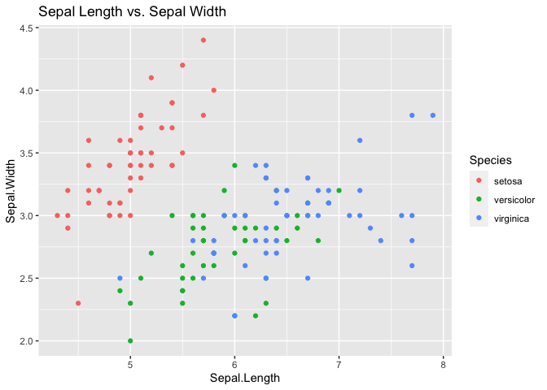
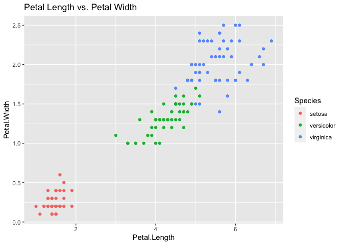

This example addresses a representative classification problem using
SVM.

The code details how to choose the best kernel for the analysis. Tuning
and cross-validation are performed.

## Load librairies and data

Load the necessary libraries and the `iris` data.

``` r
library(tidyverse)  # for ggplot
```

    ## ── Attaching core tidyverse packages ──────────────────────── tidyverse 2.0.0 ──
    ## ✔ dplyr     1.1.2     ✔ readr     2.1.4
    ## ✔ forcats   1.0.0     ✔ stringr   1.5.0
    ## ✔ ggplot2   3.4.2     ✔ tibble    3.2.1
    ## ✔ lubridate 1.9.2     ✔ tidyr     1.3.0
    ## ✔ purrr     1.0.1     
    ## ── Conflicts ────────────────────────────────────────── tidyverse_conflicts() ──
    ## ✖ dplyr::filter() masks stats::filter()
    ## ✖ dplyr::lag()    masks stats::lag()
    ## ℹ Use the conflicted package (<http://conflicted.r-lib.org/>) to force all conflicts to become errors

``` r
library(e1071)      # for SVM
set.seed(42)        # to make it reproducible

dataset <- iris
```

## Exploratory data analysis

This has already been performed in Examples above. Please refer back to
these.

We just plot here the measurements 2 by 2 (petals followed by sepals).

``` r
ggplot(iris, aes(x = Sepal.Length, y = Sepal.Width, colour = Species)) +
  geom_point() +
  labs(title = 'Sepal Length vs. Sepal Width')
```



``` r
ggplot(iris, aes(x = Petal.Length, y = Petal.Width, colour = Species)) +
  geom_point() +
  labs(title = 'Petal Length vs. Petal Width')
```



We make the following observations:

1.  For sepals, the Setosa specimens are shorter and wider, while the
    Virginica tends to have longer sepals. There is however a
    non-trivial overlap among the three.
2.  For petals, the Setosas are shorter and narrower than the other two.
    Virginica tends to have larger petals. There is still some overlap.

## SVM recap.

Datasets presenting an overall separation with some amount of overlap
are well adapted to analysis by SVMs. The SVM will provide a classifier
for new specimens, trained on the measurements in the given dataset.
This is done by computing optimal separator planes (lines in the 2-D
case) between two classes that separate all data points into one or the
other class. To achieve this, SVM simultaneously deals with three
aspects of classification:

1.  Class separation, where the algorithm attempts to find an *optimal
    separating hyperplane* between two or more classes by maximizing the
    margin between the classes’ closest points. The points lying on the
    boundaries are called *support vectors*.
2.  Overlapping classes, where data points are allowed to be on the
    wrong side of the discriminating margin, but are weighted to reduce
    their influence.
3.  Nonlinearity, where the data points can in general be separated by
    nonlinear functions.

The SVM algorithm then finds a solution by formulating the overall task
as a quadratic optimization problem that is solved by proven techniques.

## Create the model

Before fitting a model to the Iris dataset, we randomly split it into
*training* and *testing* sets, in the ratio 1/3:2/3, using the `sample`
command.

``` r
index <- c(1:nrow(iris))
test.index <- sample(index, size = (length(index)/3))
train_set <- iris[-test.index, ]
test_set  <- iris[ test.index,]
```

## Scale the features and fit the models

It is often advisable to scale the data before fitting the models,
especially when the features have very diffrent magnitudes. For the iris
data this is not really necessary (though the reader should try, by
uncommenting the first 2 lines). Following the analysis of a previous
Example, we examine both the 2-parameter model and the full model
containing all 4 parameters.

We first compute a model with a linear kernel—note that the default for
`svm` is the radial kernel.

``` r
#train_set[,1:4] <- scale(train_set[,1:4])
#test_set[,1:4]  <- scale(test_set[,1:4])

# model with ALL 4 parameters:
classifier1.linear <- svm(formula = Species ~ ., data = train_set, 
                  type = 'C-classification', kernel = 'linear')
classifier1.linear
```

    ## 
    ## Call:
    ## svm(formula = Species ~ ., data = train_set, type = "C-classification", 
    ##     kernel = "linear")
    ## 
    ## 
    ## Parameters:
    ##    SVM-Type:  C-classification 
    ##  SVM-Kernel:  linear 
    ##        cost:  1 
    ## 
    ## Number of Support Vectors:  22

``` r
# 2-parameter model:
classifier2.linear <- svm(formula = Species ~ Petal.Width + Petal.Length, data = train_set, 
                  type = 'C-classification', kernel = 'linear')
classifier2.linear
```

    ## 
    ## Call:
    ## svm(formula = Species ~ Petal.Width + Petal.Length, data = train_set, 
    ##     type = "C-classification", kernel = "linear")
    ## 
    ## 
    ## Parameters:
    ##    SVM-Type:  C-classification 
    ##  SVM-Kernel:  linear 
    ##        cost:  1 
    ## 
    ## Number of Support Vectors:  24

## Prediction and accuracy evaluation

We compute the confusion matrices and evaluate the prediction accuracy
on the training data. Note thta this could be considered as a *data
crime* (see Lectures), but since our aim is to only compare kernels,
this is acceptable. Once the best model is selected, we will of course
validate it on the *test* data.

``` r
test_pred1 = predict(classifier1.linear, type = 'response', newdata = test_set[-5])
test_pred2 = predict(classifier2.linear, type = 'response', newdata = test_set[-5])

# Compute the confusion matrices and prediction accuracy
#table(Prediction = predict(svm.model.linear, train),Truth = train$Species)
cm1 = table(test_set[,5], test_pred1)
cm2 = table(test_set[,5], test_pred2)
cm1 # Confusion Matrix for all 4 parameters
```

    ##             test_pred1
    ##              setosa versicolor virginica
    ##   setosa         19          0         0
    ##   versicolor      0         14         2
    ##   virginica       0          0        15

``` r
cat(sprintf("prediction accuracy for linear kernel = %.2f \n",
            sum(test_set$Species == test_pred1)/nrow(test_set)))
```

    ## prediction accuracy for linear kernel = 0.96

``` r
cm2 # Confusion Matrix for 2-parameter model (Petal Length and Petal Width)
```

    ##             test_pred2
    ##              setosa versicolor virginica
    ##   setosa         19          0         0
    ##   versicolor      0         15         1
    ##   virginica       0          0        15

``` r
cat(sprintf("prediction accuracy for linear kernel = %.2f \n",
            sum(test_set$Species == test_pred2)/nrow(test_set)))
```

    ## prediction accuracy for linear kernel = 0.98

We note that the 2-parameter and 4-parameter (full) models have
comparable accuracy (0.94 vs 0.98), with a slight advantage to the
simpler model. This will however vary if we resample (try this!), so we
must perform cross-validation to obtain a stable estimate. This will be
done below.

## Tune with other kernels

Now we try the polynomial, radial and sigmoid kernels. These are usually
better for more complicated overlaps in multi-class situations.

Let us try the polynomial kernel.

``` r
classifier1.polynomial <- svm(formula = Species ~ ., data = train_set, 
                  type = 'C-classification', kernel = 'polynomial')
#classifier1.polynomial
classifier2.polynomial <- svm(formula = Species ~ Petal.Width + Petal.Length, data = train_set, 
                  type = 'C-classification', kernel = 'polynomial')
#classifier2.polynomial

test_pred1 = predict(classifier1.polynomial, type = 'response', newdata = test_set[-5])
test_pred2 = predict(classifier2.polynomial, type = 'response', newdata = test_set[-5])

# Compute the confusion matrices and prediction accuracy
cm1 = table(test_set[,5], test_pred1)
cm2 = table(test_set[,5], test_pred2)
cm1 # Confusion Matrix for all parameters
```

    ##             test_pred1
    ##              setosa versicolor virginica
    ##   setosa         19          0         0
    ##   versicolor      0         15         1
    ##   virginica       0          5        10

``` r
cat(sprintf("prediction accuracy for polynomial kernel = %.2f \n",sum(test_set$Species == test_pred1)/nrow(test_set)))
```

    ## prediction accuracy for polynomial kernel = 0.88

``` r
cm2 # Confusion Matrix for 2-parameter model (Petal Length and Petal Width)
```

    ##             test_pred2
    ##              setosa versicolor virginica
    ##   setosa         19          0         0
    ##   versicolor      0         16         0
    ##   virginica       0          2        13

``` r
cat(sprintf("prediction accuracy for polynomial kernel = %.2f \n",sum(test_set$Species == test_pred2)/nrow(test_set)))
```

    ## prediction accuracy for polynomial kernel = 0.96

The accuracy is degraded, compared with the linear classifier.

Let us try the radial kernel, which is the default kernel for `svm`.

``` r
classifier1.radial <- svm(formula = Species ~ ., data = train_set, 
                  type = 'C-classification', kernel = 'radial')
#classifier1.radial
classifier2.radial <- svm(formula = Species ~ Petal.Width + Petal.Length, data = train_set, 
                  type = 'C-classification', kernel = 'radial')
#classifier2.radial

test_pred1 = predict(classifier1.radial, type = 'response', newdata = test_set[-5])
test_pred2 = predict(classifier2.radial, type = 'response', newdata = test_set[-5])

# Compute the confusion matrices and prediction accuracy
cm1 = table(test_set[,5], test_pred1)
cm2 = table(test_set[,5], test_pred2)
cm1 # Confusion Matrix for all parameters
```

    ##             test_pred1
    ##              setosa versicolor virginica
    ##   setosa         19          0         0
    ##   versicolor      0         14         2
    ##   virginica       0          0        15

``` r
cat(sprintf("prediction accuracy for radial kernel = %.2f \n",sum(test_set$Species == test_pred1)/nrow(test_set)))
```

    ## prediction accuracy for radial kernel = 0.96

``` r
cm2 # Confusion Matrix for 2-parameter model (Petal Length and Petal Width)
```

    ##             test_pred2
    ##              setosa versicolor virginica
    ##   setosa         19          0         0
    ##   versicolor      0         15         1
    ##   virginica       0          0        15

``` r
cat(sprintf("prediction accuracy for radial kernel = %.2f \n",sum(test_set$Species == test_pred2)/nrow(test_set)))
```

    ## prediction accuracy for radial kernel = 0.98

Not much difference here, compared to the linear model.

Finally, we try the sigmoid kernel.

``` r
classifier1.sigmoid <- svm(formula = Species ~ ., data = train_set, 
                  type = 'C-classification', kernel = 'sigmoid')
#classifier1.sigmoid
classifier2.sigmoid <- svm(formula = Species ~ Petal.Width + Petal.Length, data = train_set, 
                  type = 'C-classification', kernel = 'sigmoid')
#classifier2.sigmoid

test_pred1 = predict(classifier1.sigmoid, type = 'response', newdata = test_set[-5])
test_pred2 = predict(classifier2.sigmoid, type = 'response', newdata = test_set[-5])

# Compute the confusion matrices and prediction accuracy
cm1 = table(test_set[,5], test_pred1)
cm2 = table(test_set[,5], test_pred2)
cm1 # Confusion Matrix for all parameters
```

    ##             test_pred1
    ##              setosa versicolor virginica
    ##   setosa         19          0         0
    ##   versicolor      0         13         3
    ##   virginica       0          0        15

``` r
cat(sprintf("prediction accuracy for sigmoid kernel = %.2f \n",sum(test_set$Species == test_pred1)/nrow(test_set)))
```

    ## prediction accuracy for sigmoid kernel = 0.94

``` r
cm2 # Confusion Matrix for 2-parameter model (Petal Length and Petal Width)
```

    ##             test_pred2
    ##              setosa versicolor virginica
    ##   setosa         19          0         0
    ##   versicolor      1         13         2
    ##   virginica       0          0        15

``` r
cat(sprintf("prediction accuracy for sigmoid kernel = %.2f \n",sum(test_set$Species == test_pred2)/nrow(test_set)))
```

    ## prediction accuracy for sigmoid kernel = 0.94

This kernel is slightly less accurate than the linear and radial
kernels.

## Intermdiate Conclusion

The accuracy of both models is good, even very good. We conclude that
the **2-parameter** model could well suffice, with either a linear or a
radial kernel.

## Further optimization and cross-validation

To quote the official `svm` documentation: \`\`Parameters of SVM-models
usually must be tuned to yield sensible results!’’

The `e1071` package of `R` provides a tuning wrapper function, `tune()`,
as well as a function that extracts the best tuned model. The `tune`
function performs a grid search over the supplied parameter ranges. The
performance measure is the classification error (or mean-squared error
for regression). Ten-fold cross-validation is performed by default,
though this can be modified. For additional diagnostics, the cost
function’s evolution can be plotted as a function of the parameters to
obtain a performance profile. This will be done in the following
example.

Warning: the CPU time for the tuning cycle can be quite long, depending
on the dimensions of the parameter range vectors.

``` r
tuned1.svm <- tune.svm(Species~., data = train_set, kernel = 'linear',
         gamma = 0.25, cost = 2^seq(-6, 4, 2))
#        gamma = seq(1/2^nrow(iris),1, .01), cost = 2^seq(-6, 4, 2))
tuned1.svm
```

    ## 
    ## Parameter tuning of 'svm':
    ## 
    ## - sampling method: 10-fold cross validation 
    ## 
    ## - best parameters:
    ##  gamma cost
    ##   0.25    4
    ## 
    ## - best performance: 0.02

``` r
tuned2.svm <- tune.svm(Species~Petal.Width + Petal.Length, data = train_set, 
                       kernel = 'linear',
         gamma = 2^(-1:1), cost = 2^seq(-6, 4, 2))
#        gamma = seq(1/2^nrow(iris),1, .01), cost = 2^seq(-6, 4, 2))
tuned2.svm
```

    ## 
    ## Parameter tuning of 'svm':
    ## 
    ## - sampling method: 10-fold cross validation 
    ## 
    ## - best parameters:
    ##  gamma cost
    ##    0.5    1
    ## 
    ## - best performance: 0.05

Using these optimized values we create a new model and recompute the
confusion matrix and classification accuracy.

``` r
tuned1.linear <- svm(formula = Species ~ ., data = train_set, 
                  type = 'C-classification', kernel = 'linear',gamma = 0.25, cost = 0.25)
tuned2.linear <- svm(formula = Species ~ Petal.Width + Petal.Length, data = train_set, 
                  type = 'C-classification', kernel = 'linear',gamma = 0.25, cost = 1.0)

test_pred1 = predict(tuned1.linear, test_set)
  #predict(tuned1.linear, type = 'response', newdata = test_set[-5])
test_pred2 = predict(tuned2.linear, type = 'response', newdata = test_set[-5])

# Compute the confusion matrices and prediction accuracy
cm1 = table(test_set[,5], test_pred1)
cm2 = table(test_set[,5], test_pred2)
cm1 # Confusion Matrix for all parameters
```

    ##             test_pred1
    ##              setosa versicolor virginica
    ##   setosa         19          0         0
    ##   versicolor      0         14         2
    ##   virginica       0          0        15

``` r
cat(sprintf("prediction accuracy for best 4-parameter model = %.2f \n",sum(test_set$Species == test_pred1)/nrow(test_set)))
```

    ## prediction accuracy for best 4-parameter model = 0.96

``` r
cm2 # Confusion Matrix for 2-parameter model (Petal Length and Petal Width)
```

    ##             test_pred2
    ##              setosa versicolor virginica
    ##   setosa         19          0         0
    ##   versicolor      0         15         1
    ##   virginica       0          0        15

``` r
cat(sprintf("prediction accuracy for best 2-parameter model = %.2f \n ",sum(test_set$Species == test_pred2)/nrow(test_set)))
```

    ## prediction accuracy for best 2-parameter model = 0.98 
    ## 

Using the `best.svm()` method, which is is really just a wrapper for
`tune.svm(...)$best.model`.

``` r
best.svm1 <- best.svm(Species~. , data = train_set, kernel = 'linear',
                      gamma = seq(0,1, .05), cost = 2^seq(-6, 4, 2))
best.svm1
```

    ## 
    ## Call:
    ## best.svm(x = Species ~ ., data = train_set, kernel = "linear", gamma = seq(0, 
    ##     1, 0.05), cost = 2^seq(-6, 4, 2))
    ## 
    ## 
    ## Parameters:
    ##    SVM-Type:  C-classification 
    ##  SVM-Kernel:  linear 
    ##        cost:  1 
    ## 
    ## Number of Support Vectors:  22

``` r
table(Prediction = predict(best.svm1, train_set), Truth = train_set$Species)
```

    ##             Truth
    ## Prediction   setosa versicolor virginica
    ##   setosa         31          0         0
    ##   versicolor      0         33         1
    ##   virginica       0          1        34

``` r
best.svm.pred1 <- predict(best.svm1, test_set)
table(Prediction = best.svm.pred1, Truth = test_set$Species)
```

    ##             Truth
    ## Prediction   setosa versicolor virginica
    ##   setosa         19          0         0
    ##   versicolor      0         14         0
    ##   virginica       0          2        15

``` r
cat(sprintf("prediction accuracy for best 4-parameter model = %.2f \n",sum(test_set$Species == best.svm.pred1)/nrow(test_set)))
```

    ## prediction accuracy for best 4-parameter model = 0.96

Excellent precision for the full model.

``` r
best.svm2 <- best.svm(Species ~ Petal.Width + Petal.Length, data = train_set, kernel = 'linear')
best.svm2
```

    ## 
    ## Call:
    ## best.svm(x = Species ~ Petal.Width + Petal.Length, data = train_set, 
    ##     kernel = "linear")
    ## 
    ## 
    ## Parameters:
    ##    SVM-Type:  C-classification 
    ##  SVM-Kernel:  linear 
    ##        cost:  1 
    ## 
    ## Number of Support Vectors:  24

``` r
table(Prediction = predict(best.svm2, train_set), Truth = train_set$Species)
```

    ##             Truth
    ## Prediction   setosa versicolor virginica
    ##   setosa         31          0         0
    ##   versicolor      0         33         4
    ##   virginica       0          1        31

``` r
best.svm.pred2 <- predict(best.svm2, test_set)
table(Prediction = best.svm.pred2, Truth = test_set$Species)
```

    ##             Truth
    ## Prediction   setosa versicolor virginica
    ##   setosa         19          0         0
    ##   versicolor      0         15         0
    ##   virginica       0          1        15

``` r
cat(sprintf("prediction accuracy for best 2-parameter model = %.2f \n",sum(test_set$Species == best.svm.pred2)/nrow(test_set)))
```

    ## prediction accuracy for best 2-parameter model = 0.98

The 2-parameter model performs admirably, with a slightly higher
precision.
