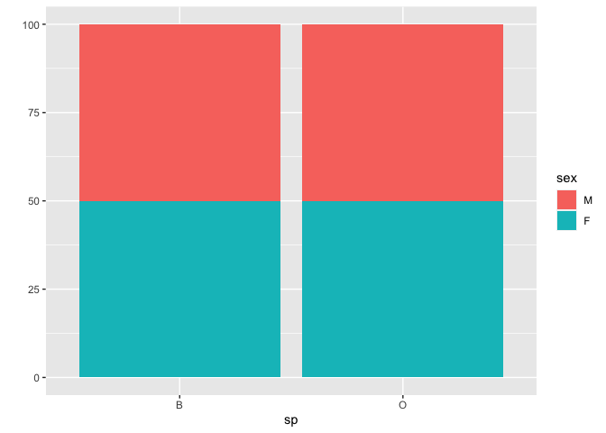
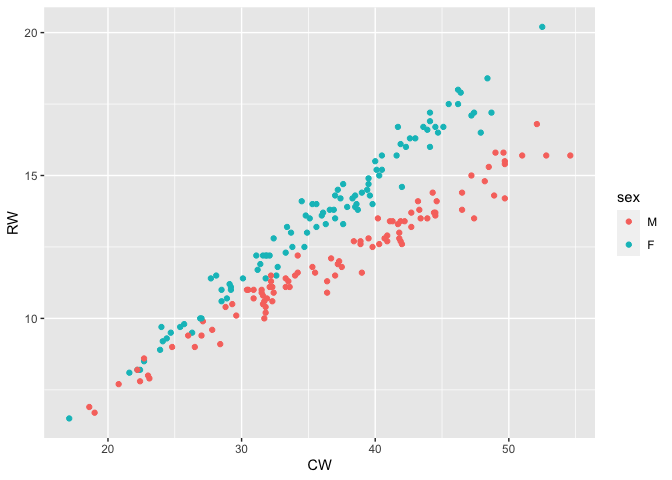
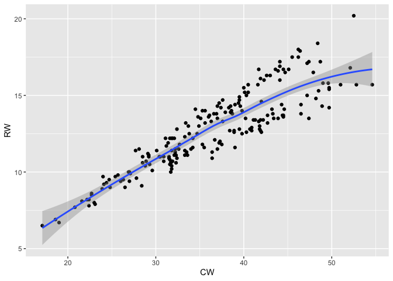
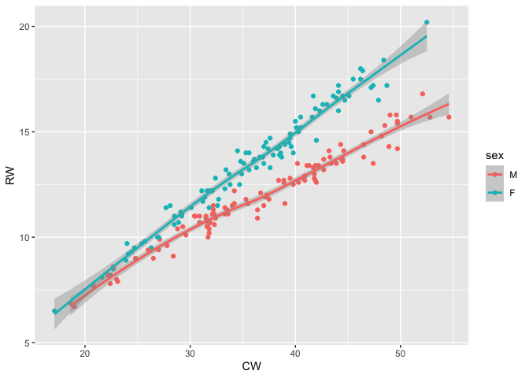
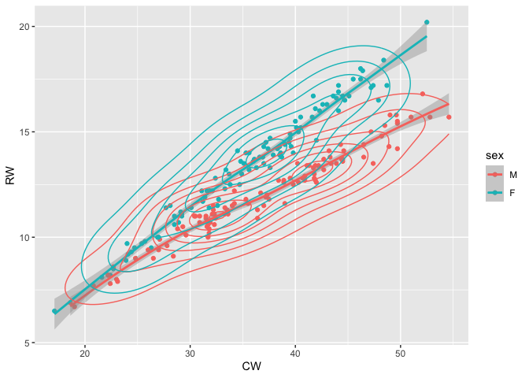
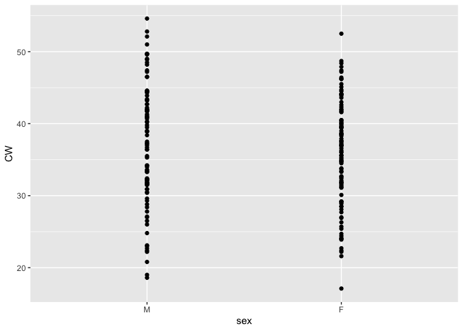
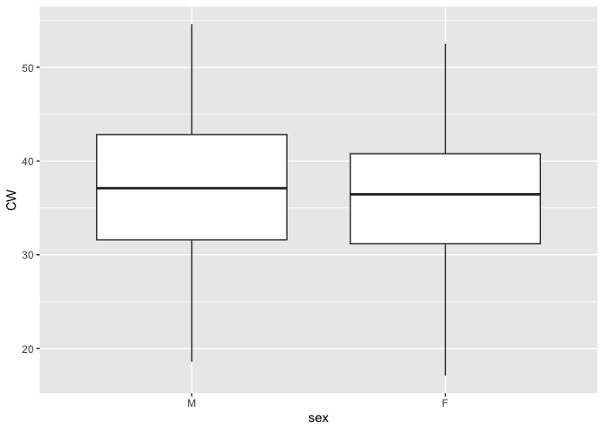
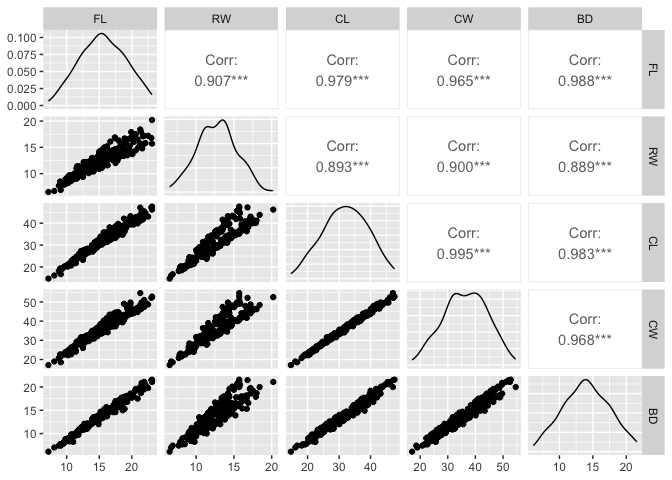
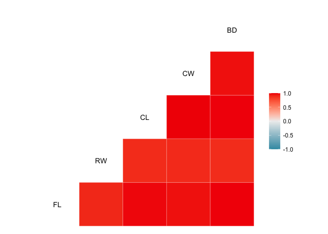

# Exploratory Data Analysis (EDA) for `crabs` Data


## Load packages and data

To be able to charcaterize rapidly the univariate and bivariate
distributions of a dataset is indispensable for its understanding and
for gaining insight **before** any statistical modeling is started.

We start by loading

-   `ggplot2` package, that produces nice grpahical representations,
-   `MASS` package that contains a large number of datasets.
-   the `crabs` dataset

``` r
library(ggplot2)
library(MASS)

data()  # see all available datasets
help(crabs) # details of crab dataset
data(crabs)  # load crab dataset 
str(crabs) # describe the variables
```

    ## 'data.frame':    200 obs. of  8 variables:
    ##  $ sp   : Factor w/ 2 levels "B","O": 1 1 1 1 1 1 1 1 1 1 ...
    ##  $ sex  : Factor w/ 2 levels "F","M": 2 2 2 2 2 2 2 2 2 2 ...
    ##  $ index: int  1 2 3 4 5 6 7 8 9 10 ...
    ##  $ FL   : num  8.1 8.8 9.2 9.6 9.8 10.8 11.1 11.6 11.8 11.8 ...
    ##  $ RW   : num  6.7 7.7 7.8 7.9 8 9 9.9 9.1 9.6 10.5 ...
    ##  $ CL   : num  16.1 18.1 19 20.1 20.3 23 23.8 24.5 24.2 25.2 ...
    ##  $ CW   : num  19 20.8 22.4 23.1 23 26.5 27.1 28.4 27.8 29.3 ...
    ##  $ BD   : num  7 7.4 7.7 8.2 8.2 9.8 9.8 10.4 9.7 10.3 ...

We observe

-   there are 200 samples of 8 variables
-   the variables are a mix of cataegorical and numerical data

## Basic statistics

We **always** start by computing the summary statistics.

``` r
summary(crabs) 
```

    ##  sp      sex         index            FL              RW              CL       
    ##  B:100   F:100   Min.   : 1.0   Min.   : 7.20   Min.   : 6.50   Min.   :14.70  
    ##  O:100   M:100   1st Qu.:13.0   1st Qu.:12.90   1st Qu.:11.00   1st Qu.:27.27  
    ##                  Median :25.5   Median :15.55   Median :12.80   Median :32.10  
    ##                  Mean   :25.5   Mean   :15.58   Mean   :12.74   Mean   :32.11  
    ##                  3rd Qu.:38.0   3rd Qu.:18.05   3rd Qu.:14.30   3rd Qu.:37.23  
    ##                  Max.   :50.0   Max.   :23.10   Max.   :20.20   Max.   :47.60  
    ##        CW              BD       
    ##  Min.   :17.10   Min.   : 6.10  
    ##  1st Qu.:31.50   1st Qu.:11.40  
    ##  Median :36.80   Median :13.90  
    ##  Mean   :36.41   Mean   :14.03  
    ##  3rd Qu.:42.00   3rd Qu.:16.60  
    ##  Max.   :54.60   Max.   :21.60

Now, we proceed to study the categorical variables.

``` r
table(crabs$sex) # how many in each category
```

    ## 
    ##   F   M 
    ## 100 100

``` r
head(crabs$sex)
```

    ## [1] M M M M M M
    ## Levels: F M

``` r
levels(crabs$sex) # levels
```

    ## [1] "F" "M"

``` r
nlevels(crabs$sex)
```

    ## [1] 2

``` r
str(crabs)
```

    ## 'data.frame':    200 obs. of  8 variables:
    ##  $ sp   : Factor w/ 2 levels "B","O": 1 1 1 1 1 1 1 1 1 1 ...
    ##  $ sex  : Factor w/ 2 levels "F","M": 2 2 2 2 2 2 2 2 2 2 ...
    ##  $ index: int  1 2 3 4 5 6 7 8 9 10 ...
    ##  $ FL   : num  8.1 8.8 9.2 9.6 9.8 10.8 11.1 11.6 11.8 11.8 ...
    ##  $ RW   : num  6.7 7.7 7.8 7.9 8 9 9.9 9.1 9.6 10.5 ...
    ##  $ CL   : num  16.1 18.1 19 20.1 20.3 23 23.8 24.5 24.2 25.2 ...
    ##  $ CW   : num  19 20.8 22.4 23.1 23 26.5 27.1 28.4 27.8 29.3 ...
    ##  $ BD   : num  7 7.4 7.7 8.2 8.2 9.8 9.8 10.4 9.7 10.3 ...

``` r
crabs$sex <- relevel(crabs$sex, ref = "M")  ## 'Male' is the reference level
str(crabs)  # numerical values of $sex have changed
```

    ## 'data.frame':    200 obs. of  8 variables:
    ##  $ sp   : Factor w/ 2 levels "B","O": 1 1 1 1 1 1 1 1 1 1 ...
    ##  $ sex  : Factor w/ 2 levels "M","F": 1 1 1 1 1 1 1 1 1 1 ...
    ##  $ index: int  1 2 3 4 5 6 7 8 9 10 ...
    ##  $ FL   : num  8.1 8.8 9.2 9.6 9.8 10.8 11.1 11.6 11.8 11.8 ...
    ##  $ RW   : num  6.7 7.7 7.8 7.9 8 9 9.9 9.1 9.6 10.5 ...
    ##  $ CL   : num  16.1 18.1 19 20.1 20.3 23 23.8 24.5 24.2 25.2 ...
    ##  $ CW   : num  19 20.8 22.4 23.1 23 26.5 27.1 28.4 27.8 29.3 ...
    ##  $ BD   : num  7 7.4 7.7 8.2 8.2 9.8 9.8 10.4 9.7 10.3 ...

## Univariate explorations

Our first graphics are univariate. We will use the `qplot` command of
`ggplot2` for a “quick and easy” initial presentation. For more detailed
plots, the full power of `ggplot` should be used…

``` r
qplot(CW, data = crabs)
```

    ## Warning: `qplot()` was deprecated in ggplot2 3.4.0.
    ## This warning is displayed once every 8 hours.
    ## Call `lifecycle::last_lifecycle_warnings()` to see where this warning was
    ## generated.

    ## `stat_bin()` using `bins = 30`. Pick better value with `binwidth`.


``` r
qplot(CW, data = crabs, geom = "histogram")
```

    ## `stat_bin()` using `bins = 30`. Pick better value with `binwidth`.


``` r
qplot(sp, data = crabs)
```


``` r
qplot(sp, data = crabs, fill = sex)
```



``` r
with(crabs, table(sp, sex))
```

    ##    sex
    ## sp   M  F
    ##   B 50 50
    ##   O 50 50

Now we explore the numerical variables.

``` r
qplot(CW, RW, data = crabs)
```


``` r
qplot(CW, RW, data = crabs, geom = "point")
```


``` r
qplot(CW, RW, data = crabs, geom = c("point", "density2d"))
```


``` r
qplot(CW, RW, data = crabs, color = sex)
```



``` r
qplot(CW, RW, data = crabs, color = sp)
```


Note the use of color to “separate” the categorical variables, sex and
species. And note the insight obtained thanks to the sepration in the
case of color by sex.

Now we change the variables and use the `facets` option to produce
side-by-side plots.

``` r
qplot(CW, FL, data = crabs, color = sex)
```


``` r
qplot(CW, FL, data = crabs, color = sp)
```


``` r
qplot(CW, FL, data = crabs, facets = . ~ sp)
```


``` r
qplot(CW, FL, data = crabs, facets = . ~ sp, color = sex)
```


Finally, we explore other options of `ggplot` to investigate possible
trends in the data.

``` r
qplot(CW, RW, data = crabs)
```


``` r
qplot(CW, RW, data = crabs, geom = c("point"))
```


``` r
qplot(CW, RW, data = crabs, geom = c("point", "smooth"))
```

    ## `geom_smooth()` using method = 'loess' and formula = 'y ~ x'



``` r
qplot(CW, RW, data = crabs, geom = c("point", "smooth"), color = sex)
```

    ## `geom_smooth()` using method = 'loess' and formula = 'y ~ x'



``` r
qplot(CW, RW, data = crabs, geom = c("point", "smooth", "density2d"), color = sex)
```

    ## `geom_smooth()` using method = 'loess' and formula = 'y ~ x'



### Boxplots

Boxplots, and their variants, are an excellent way to display a mix of
categorical and numerical data.

``` r
qplot(sex, CW, data = crabs)
```



``` r
qplot(sex, CW, data = crabs, geom = "point")
```


``` r
qplot(sex, CW, data = crabs, geom = "boxplot")
```



``` r
qplot(sex, CW, data = crabs, geom = "boxplot", facets = . ~ sp)
```


``` r
qplot(sex, CW, data = crabs, geom = "boxplot", facets = sp ~ .)
```


``` r
qplot(sex, CW, data = crabs, geom = "violin")
```


``` r
qplot(sex, CW, data = crabs, geom = c("violin", "point"))
```


## Bivariate studies

To explore possible dependencies between variables, we

-   isolate the numerical data
-   draw a scatter plot
-   visualize the correlations

The `GGally` package is required for this.

``` r
crabs.mat <- crabs[, 4:8]
library(GGally)
```

    ## Registered S3 method overwritten by 'GGally':
    ##   method from   
    ##   +.gg   ggplot2

``` r
help(ggpairs)
#scatter plot
ggpairs(crabs.mat)
```



``` r
# correlation plot
ggcorr(crabs.mat)
```



## Observations and Conclusions

Many, very interesting observations and conclusions can be drawn from
this EDA.

-   Conclusion 1
-   Conclusion 2
-   Conclusion 3

…
