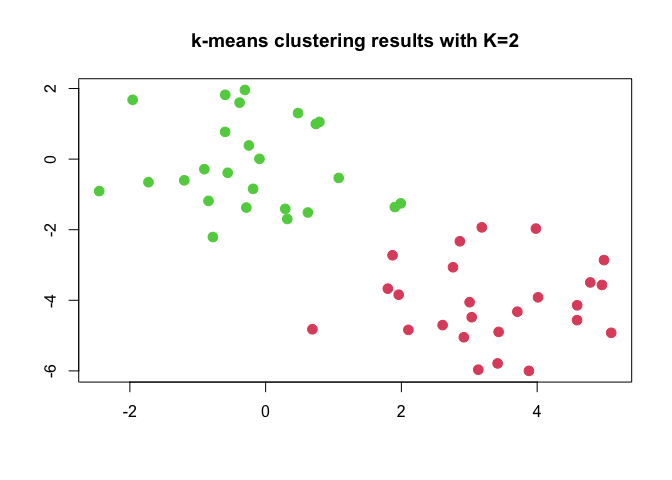
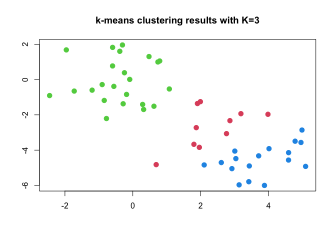

The `kmeans`function of `R` implements the *k*-means clustering
algorithm. We construct a simple, artifical example in order to bring
out some of the basic points seen above.

Let us simulate a dataset with two clusters of Gaussian random
variables, having a shift in their mean values.

``` r
set.seed(2)
x         <- matrix(rnorm(50*2), ncol=2)
x[1:25,1] <- x[1:25,1]+3
x[1:25,2] <- x[1:25,2]-4
head(x)
```

    ##          [,1]      [,2]
    ## [1,] 2.103085 -4.838287
    ## [2,] 3.184849 -1.933699
    ## [3,] 4.587845 -4.562247
    ## [4,] 1.869624 -2.724284
    ## [5,] 2.919748 -5.047573
    ## [6,] 3.132420 -5.965878

First, we perform k-means with *K* = 2.

``` r
km.out=kmeans(x,2)
```

The affectations of the observations are in the variable `cluster`

``` r
km.out$cluster
```

    ##  [1] 1 1 1 1 1 1 1 1 1 1 1 1 1 1 1 1 1 1 1 1 1 1 1 1 1 2 2 2 2 2 2 2 2 2 2 2 2 2
    ## [39] 2 2 2 2 2 2 2 2 2 2 2 2

We observe that k-means has perfectly separated the observations into
two clusters, without us having supplied any group information to
`kmeans()`.

Let us plot the observations, each point colored according to its
affectation.

``` r
plot(x, col=(km.out$cluster+1), main="k-means clustering results with K=2", xlab="", ylab="", pch=20, cex=2)
```



The observations were easy to plot here, since we are in two dimensions
only. In the case of more than two variables, we could perform a PCA,
and then plot the two first principal components, for example.

In this simulated example, we knew the number of clusters. But in
general, this is definitely not the case. So we could have started by
trying *K* = 3.

``` r
set.seed(4)
km.out=kmeans(x,3,nstart=20)
km.out
```

    ## K-means clustering with 3 clusters of sizes 10, 23, 17
    ## 
    ## Cluster means:
    ##         [,1]        [,2]
    ## 1  2.3001545 -2.69622023
    ## 2 -0.3820397 -0.08740753
    ## 3  3.7789567 -4.56200798
    ## 
    ## Clustering vector:
    ##  [1] 3 1 3 1 3 3 3 1 3 1 3 1 3 1 3 1 3 3 3 3 3 1 3 3 3 2 2 2 2 2 2 2 2 2 2 2 2 2
    ## [39] 2 2 2 2 2 1 2 1 2 2 2 2
    ## 
    ## Within cluster sum of squares by cluster:
    ## [1] 19.56137 52.67700 25.74089
    ##  (between_SS / total_SS =  79.3 %)
    ## 
    ## Available components:
    ## 
    ## [1] "cluster"      "centers"      "totss"        "withinss"     "tot.withinss"
    ## [6] "betweenss"    "size"         "iter"         "ifault"

``` r
plot(x, col=(km.out$cluster+1), main="k-means clustering results with K=3", xlab="", ylab="", pch=20, cex=2)
```



Here, the algorithm has divided one of the two clusters. Note that we
have used the parameter `nstart=20` which instructs the algorithm to
perform 20 restarts with different, random initial clusters. To compare
the performance of no restart, `nstart=1`, with 20 restarts,
`nstart=20`, we extract the vectors of intra-cluster sum of squares,
`km.out$withinss` and recover their totals in `km.out$tot.withinss`.

``` r
set.seed(3)
km.out=kmeans(x,3,nstart=1)
km.out$tot.withinss
```

    ## [1] 97.97927

``` r
km.out=kmeans(x,3,nstart=20)
km.out$tot.withinss
```

    ## [1] 97.97927

The restarting has effectively reduced the value of the intra-cluster
**total** sum of squares, and we have thus attained a better optimum
(minimum). It is strongly recommended to use a high value of `nstart`
whenever we perform k-means clustering. Values of 20 or 50 are commonly
used. The `set.seed()` command is just for reproducibility.
