# Linear Regression for Photosynthesis Data

The file `photo.csv` contains data on the net maximal rate of
photosynthesis of 198 plant species together with 4 other attributes
related to their leaves. These are real, field data.

The variables are:

-   Code: a code denoting the species
-   LeafType: type of leaf (sunleaf or whole plant)
-   Amax: the net maximal rate of photosynthesis (A=assimilation)
-   LDMC: concentration of dry matter in the leaf
-   SLA: specific surface area of the leaf
-   LNC: concentration of organic nitrogen in the leaf

## Objective

Perform a simple linear regression to predict the net rate of
photosynthesis (Amax) given the specific leaf area (SLA). Of course,
many other models are possible…

``` r
# Read in the  data
photo <- read.csv("./photo.csv",header=T)
# display variable names and first lines
names(photo)
```

    ## [1] "Code"      "LeafType"  "Amax"      "LDMC"      "SLA"       "thickness"
    ## [7] "LNC"

``` r
head(photo)
```

    ##     Code LeafType   Amax LDMC  SLA thickness   LNC
    ## 1 Acemon Sun leaf 145.29  421 14.3    157.45 21.28
    ## 2 Brapho Sun leaf 246.67  373 18.0    138.63 21.14
    ## 3 Cramon Sun leaf 170.73  361 14.1    190.74 18.90
    ## 4 Cramon Sun leaf 170.73  361 14.1    190.74 18.90
    ## 5 Dorpen Sun leaf 178.48  277 18.3    191.63 34.16
    ## 6 Plalan Sun leaf 335.49  166 19.9    307.26 23.94

We perform some basic EDA

-   a scatter plot of the explanatory and the response varible, colored
    by leaf type
-   histograms of the variables of interest

``` r
library(ggplot2)
ggplot(photo, aes(x=SLA, y=Amax, shape =LeafType, color=LeafType)) +
       geom_point()
```

    ## Warning: Removed 1 rows containing missing values (`geom_point()`).

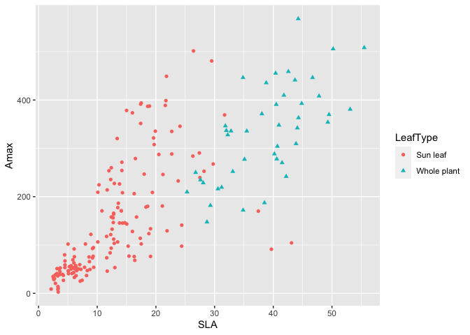

``` r
ggplot(photo, aes(x=SLA)) +
    geom_histogram(binwidth=5, fill="#69b3a2", color="#e9ecef", alpha=0.9) +
    ggtitle("SLA")
```

    ## Warning: Removed 1 rows containing non-finite values (`stat_bin()`).

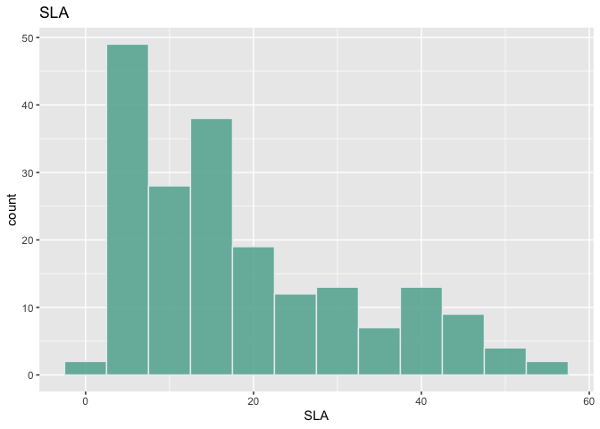

``` r
ggplot(photo, aes(x=Amax)) +
    geom_histogram(binwidth=40, fill="red", color="#e9ecef", alpha=0.9) +
    ggtitle("Amax")
```

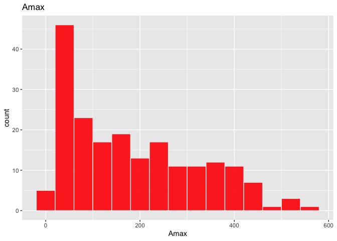

There is a clearly a correlation between the two, with whole plants
having higher values, in general..

Summary statistics:

``` r
# Summary overview of `photo`
summary(photo) 
```

    ##      Code             LeafType              Amax              LDMC      
    ##  Length:197         Length:197         Min.   :  2.661   Min.   : 83.0  
    ##  Class :character   Class :character   1st Qu.: 58.700   1st Qu.:197.0  
    ##  Mode  :character   Mode  :character   Median :156.210   Median :308.0  
    ##                                        Mean   :185.737   Mean   :313.5  
    ##                                        3rd Qu.:287.320   3rd Qu.:428.0  
    ##                                        Max.   :568.100   Max.   :571.0  
    ##                                                                         
    ##       SLA          thickness            LNC        
    ##  Min.   : 2.14   Min.   :  87.04   Min.   : 5.053  
    ##  1st Qu.: 7.19   1st Qu.: 155.28   1st Qu.:16.900  
    ##  Median :14.25   Median : 241.60   Median :21.280  
    ##  Mean   :18.52   Mean   : 299.85   Mean   :26.940  
    ##  3rd Qu.:27.43   3rd Qu.: 368.79   3rd Qu.:35.112  
    ##  Max.   :55.50   Max.   :1283.53   Max.   :66.640  
    ##  NA's   :1       NA's   :1

There are some missing values here, but they will be automatically
treated by the linear regression.

Let us perform an initial linear regression of Amax as a function of
SLA, and inspect the results.

``` r
lr1 <- lm(Amax ~ SLA, data=photo, na.action=na.omit)
#par(mfrow=c(2,2))
plot(lr1)
```

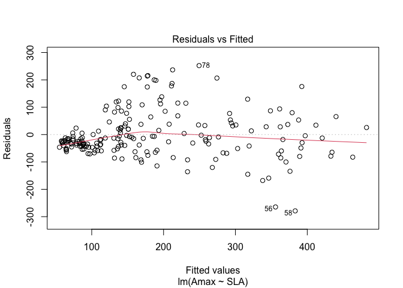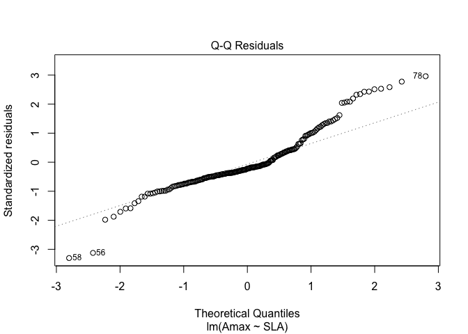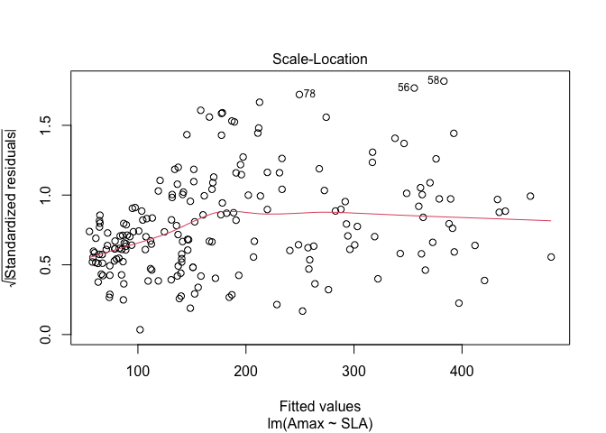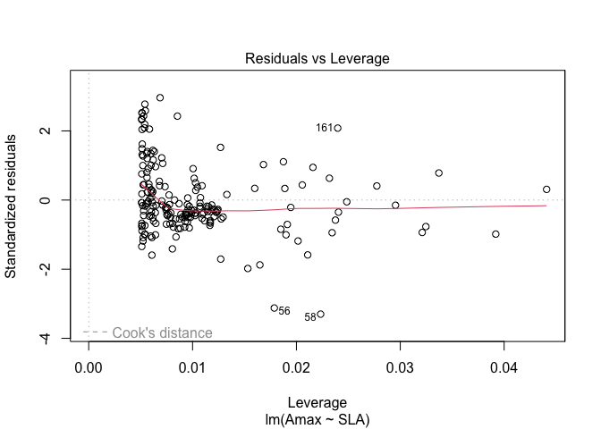

``` r
summary(lr1)
```

    ## 
    ## Call:
    ## lm(formula = Amax ~ SLA, data = photo, na.action = na.omit)
    ## 
    ## Residuals:
    ##     Min      1Q  Median      3Q     Max 
    ## -278.91  -46.48  -18.89   35.15  252.16 
    ## 
    ## Coefficients:
    ##             Estimate Std. Error t value Pr(>|t|)    
    ## (Intercept)  38.0082    10.4289   3.645 0.000344 ***
    ## SLA           8.0088     0.4564  17.547  < 2e-16 ***
    ## ---
    ## Signif. codes:  0 '***' 0.001 '**' 0.01 '*' 0.05 '.' 0.1 ' ' 1
    ## 
    ## Residual standard error: 85.47 on 194 degrees of freedom
    ##   (1 observation deleted due to missingness)
    ## Multiple R-squared:  0.6135, Adjusted R-squared:  0.6115 
    ## F-statistic: 307.9 on 1 and 194 DF,  p-value: < 2.2e-16

## Analysis of model `lr1`

As expected from the scatter plot, the results are not very
satisfactory. In spite of highly significant coefficients, the R-squared
value is low and the diagnostic plots show:

1.  A lack of homoscedasticity.
2.  A clear deviation of the residulas from a Gaussian distributioN

This suggests that we try a nonlinear change of variables to better
capture the biological phenomenon.

One possibility is to regress the logarithm of Amax on the logarithm of
SLA. This intuition come from an allometric law that is known to
describe many biological processes.

``` r
# Fit an allometric relation
#.    ln(y) = a + b*ln(x)
lr2<-lm(log(Amax)~log(SLA),data=photo,na.action=na.omit)
plot(lr2)
```

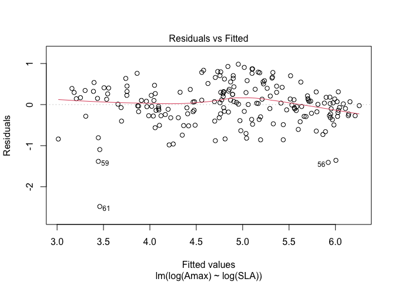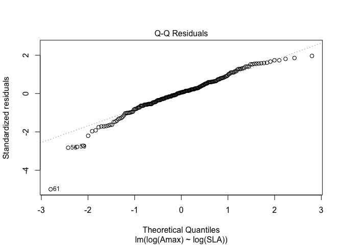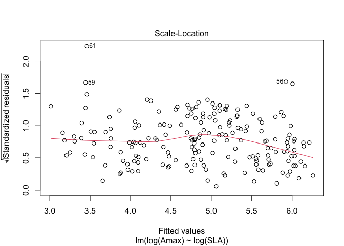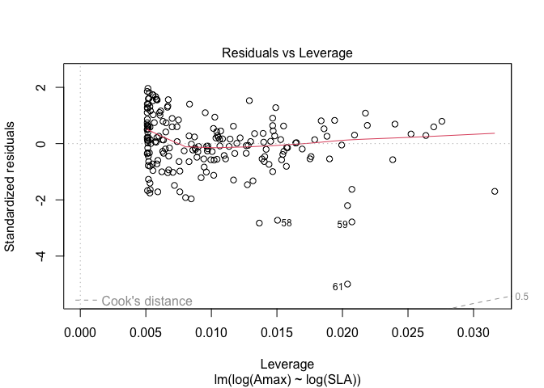

``` r
summary(lr2)
```

    ## 
    ## Call:
    ## lm(formula = log(Amax) ~ log(SLA), data = photo, na.action = na.omit)
    ## 
    ## Residuals:
    ##      Min       1Q   Median       3Q      Max 
    ## -2.48121 -0.27108  0.02948  0.30923  0.98282 
    ## 
    ## Coefficients:
    ##             Estimate Std. Error t value Pr(>|t|)    
    ## (Intercept)  2.25514    0.12055   18.71   <2e-16 ***
    ## log(SLA)     0.99630    0.04388   22.71   <2e-16 ***
    ## ---
    ## Signif. codes:  0 '***' 0.001 '**' 0.01 '*' 0.05 '.' 0.1 ' ' 1
    ## 
    ## Residual standard error: 0.5018 on 194 degrees of freedom
    ##   (1 observation deleted due to missingness)
    ## Multiple R-squared:  0.7266, Adjusted R-squared:  0.7252 
    ## F-statistic: 515.6 on 1 and 194 DF,  p-value: < 2.2e-16

## Conclusions

-   The allometric relation has improved the model.
-   The value of R-squared has increased from 0.6135 to 0.7266
-   The residuals are more homogeneously distributed.
