# Regression on Concrete Data

## Introduction

Concrete is the most important material in civil engineering. The dataset has 9 attributes including 8 quantitative input variables, and 1 quantitative output variable.
The dataset can be downloaded and viewed at: https://archive.ics.uci.edu/ml/datasets/concrete+compressive+strength 

The compressive strength of concrete determines its quality, and is tested by a standard crushing test on a concrete cylinder. Concrete strength is also considered a key factor in obtaining the desired durability. But  testing for strength can take 28 days, which is very long. Our aim is to use  Machine Learning to reduce this effort and be able to predict the composition of raw materials for good compressive strength. This is an example of _Surrogate Modeling_, an important approach for combining Machine Learning with scientific research.

The features are:

- Cement: a substance used for construction that hardens to other materials to bind them together. 
- Slag: Mixture of metal oxides and silicon dioxide.
- Fly ash: coal combustion product that is composed of the particulates that are driven out of coal-fired boilers together with the flue gases.
- Water: used to form a thick paste.
- Superplasticizer: used in making high-strength concrete.
- Coaseseaggregate: prices of rocks obtained from ground deposits.
- Fine aggregate: the size of aggregate smaller than 4.75mm.
- Age: Rate of gain of strength is faster to start with and the rate gets reduced with age. csMPa: Measurement unit of concrete strength. This variable, present in the original dataste, is not used here.
- Air entrainement: a categorical variable, signalling the use of air entraienment, known to have a beneficial effect in resisting the damage caused to concrete by the freezing/thawing cycles, but a negative effect on the compressive strength of concrete.

The output is:

- Concrete compressive strength: a value in MPa

## Simple Linear Regression

## Preliminaries


```python
import pandas as pd
#con = pd.read_csv('concrete_data.csv')
con = pd.read_csv('ConcreteStrength.csv', sep=';', decimal=",")
con.rename(columns={'Fly ash': 'FlyAsh', 'Coarse Aggr.': "CoarseAgg",
                    'Fine Aggr.': 'FineAgg', 'Air Entrainment': 'AirEntrain', 
                    'Compressive Strength (28-day)(Mpa)': 'Strength'}, inplace=True)
con['AirEntrain'] = con['AirEntrain'].astype('category')
con.head()
```


<div>
<style scoped>
    .dataframe tbody tr th:only-of-type {
        vertical-align: middle;
    }

    .dataframe tbody tr th {
        vertical-align: top;
    }

    .dataframe thead th {
        text-align: right;
    }
</style>
<table border="1" class="dataframe">
  <thead>
    <tr style="text-align: right;">
      <th></th>
      <th>No</th>
      <th>Cement</th>
      <th>Slag</th>
      <th>FlyAsh</th>
      <th>Water</th>
      <th>SP</th>
      <th>CoarseAgg</th>
      <th>FineAgg</th>
      <th>AirEntrain</th>
      <th>Strength</th>
    </tr>
  </thead>
  <tbody>
    <tr>
      <th>0</th>
      <td>1</td>
      <td>273.0</td>
      <td>82.0</td>
      <td>105.0</td>
      <td>210.0</td>
      <td>9.0</td>
      <td>904.0</td>
      <td>680.0</td>
      <td>No</td>
      <td>34.990</td>
    </tr>
    <tr>
      <th>1</th>
      <td>2</td>
      <td>163.0</td>
      <td>149.0</td>
      <td>191.0</td>
      <td>180.0</td>
      <td>12.0</td>
      <td>843.0</td>
      <td>746.0</td>
      <td>Yes</td>
      <td>32.272</td>
    </tr>
    <tr>
      <th>2</th>
      <td>3</td>
      <td>162.0</td>
      <td>148.0</td>
      <td>191.0</td>
      <td>179.0</td>
      <td>16.0</td>
      <td>840.0</td>
      <td>743.0</td>
      <td>Yes</td>
      <td>35.450</td>
    </tr>
    <tr>
      <th>3</th>
      <td>4</td>
      <td>162.0</td>
      <td>148.0</td>
      <td>190.0</td>
      <td>179.0</td>
      <td>19.0</td>
      <td>838.0</td>
      <td>741.0</td>
      <td>No</td>
      <td>42.080</td>
    </tr>
    <tr>
      <th>4</th>
      <td>5</td>
      <td>154.0</td>
      <td>112.0</td>
      <td>144.0</td>
      <td>220.0</td>
      <td>10.0</td>
      <td>923.0</td>
      <td>658.0</td>
      <td>No</td>
      <td>26.820</td>
    </tr>
  </tbody>
</table>
</div>


## Linear regression with a single explanatory variable

There are many ways to do linear regression in Python.  We have already seen the Statsmodels library, so we will continue to use it here.  It has much more functionality than we need, but it provides nicely-formatted output.

The method we will use to create linear regression models in the Statsmodels library is `OLS()`.  OLS stands for "ordinary least squares", which means the algorithm finds the best fit line by minimizing the squared residuals (this is "least squares").  The "ordinary" part of the name gives us the sense that the type of linear regression we are seeing here is just the tip of the methodological iceberg.  There is a whole world of non-ordinary regression techniques out there intended to address this or that methodological problem or circumstance.  These will be seen in a later example.

### Preparing the data

Recall the general format of the linear regression equation:
$$Y = \beta_0 + \beta_1 X_1 + ... + \beta_p X_p,$$
where $Y$ is the value of the response variable and $X_i$ is the value of the explanatory variable(s).

If we think about this equation in matrix terms, we see that _Y_ is a 1-dimensional matrix: it is just a single column (or array or vector) of numbers.  In our case, this vector corresponds to the compressive strength of different batches of concrete measured in megapascals.  The right-hand side of the equation is actually a 2-dimensional matrix: there is one column for our _X_ variable and another column for the constant. 

Creating a linear regression model in Statsmodels requires the following steps:
1. Import the Statsmodels library
2. Define _Y_ and _X_ matrices.  This is optional, but it keeps the `OLS()` call easier to read
3. Add a constant column to the _X_ matrix
4. Call `OLS()` to define the model
5. Call `fit()` to actually estimate the model parameters using the data set (fit the line)
6. Display the results

Let's start with the first three steps:


```python
import statsmodels.api as sm
Y = con['Strength']
X = con['FlyAsh']
X.head()
```


    0    105.0
    1    191.0
    2    191.0
    3    190.0
    4    144.0
    Name: FlyAsh, dtype: float64


We see above that _X_ is a single column of numbers (amount of fly ash in each batch of concrete).  The numbers on the left are just the Python index (every row in a Python array has a row number, or index).

### Adding a column for the constant

We can add another column for the regression constant using Statsmodels `add_constant()` method:


```python
X = sm.add_constant(X)
X.head()
```


<div>
<style scoped>
    .dataframe tbody tr th:only-of-type {
        vertical-align: middle;
    }

    .dataframe tbody tr th {
        vertical-align: top;
    }

    .dataframe thead th {
        text-align: right;
    }
</style>
<table border="1" class="dataframe">
  <thead>
    <tr style="text-align: right;">
      <th></th>
      <th>const</th>
      <th>FlyAsh</th>
    </tr>
  </thead>
  <tbody>
    <tr>
      <th>0</th>
      <td>1.0</td>
      <td>105.0</td>
    </tr>
    <tr>
      <th>1</th>
      <td>1.0</td>
      <td>191.0</td>
    </tr>
    <tr>
      <th>2</th>
      <td>1.0</td>
      <td>191.0</td>
    </tr>
    <tr>
      <th>3</th>
      <td>1.0</td>
      <td>190.0</td>
    </tr>
    <tr>
      <th>4</th>
      <td>1.0</td>
      <td>144.0</td>
    </tr>
  </tbody>
</table>
</div>


Notice the difference: the _X_ matrix has been augmented with a column of 1s called "const".  To see why, recall the point of linear regression: to use data to "learn" the parameters of the best-fit line and use the parameters to make predictions.  The parameters of a line are its _y_-intercept and slope.  Once we have the _y_-intercept and slope ($\beta_0$ and $\beta_1$ in the equation above or _b_ and _m_ in grade 9 math), we can multiply them by the data in the _X_ matrix to get a prediction for _Y_.

Written out in words for the first row of our data, we get:

> Concrete strength estimate = $\beta_0$ x 1 + $\beta_1$ x 105.0

The "const" column simply provides a placeholder&mdash;a bunch of 1's to multiply the constant by.  So now we understand why we have to run `add_constant()`.

### Running the model


```python
model = sm.OLS(Y, X, missing='drop')

model_result = model.fit()
model_result.summary()
```


<table class="simpletable">
<caption>OLS Regression Results</caption>
<tr>
  <th>Dep. Variable:</th>        <td>Strength</td>     <th>  R-squared:         </th> <td>   0.165</td>
</tr>
<tr>
  <th>Model:</th>                   <td>OLS</td>       <th>  Adj. R-squared:    </th> <td>   0.157</td>
</tr>
<tr>
  <th>Method:</th>             <td>Least Squares</td>  <th>  F-statistic:       </th> <td>   19.98</td>
</tr>
<tr>
  <th>Date:</th>             <td>Sun, 10 Sep 2023</td> <th>  Prob (F-statistic):</th> <td>2.05e-05</td>
</tr>
<tr>
  <th>Time:</th>                 <td>12:21:45</td>     <th>  Log-Likelihood:    </th> <td> -365.58</td>
</tr>
<tr>
  <th>No. Observations:</th>      <td>   103</td>      <th>  AIC:               </th> <td>   735.2</td>
</tr>
<tr>
  <th>Df Residuals:</th>          <td>   101</td>      <th>  BIC:               </th> <td>   740.4</td>
</tr>
<tr>
  <th>Df Model:</th>              <td>     1</td>      <th>                     </th>     <td> </td>   
</tr>
<tr>
  <th>Covariance Type:</th>      <td>nonrobust</td>    <th>                     </th>     <td> </td>   
</tr>
</table>
<table class="simpletable">
<tr>
     <td></td>       <th>coef</th>     <th>std err</th>      <th>t</th>      <th>P>|t|</th>  <th>[0.025</th>    <th>0.975]</th>  
</tr>
<tr>
  <th>const</th>  <td>   26.2764</td> <td>    1.691</td> <td>   15.543</td> <td> 0.000</td> <td>   22.923</td> <td>   29.630</td>
</tr>
<tr>
  <th>FlyAsh</th> <td>    0.0440</td> <td>    0.010</td> <td>    4.470</td> <td> 0.000</td> <td>    0.024</td> <td>    0.064</td>
</tr>
</table>
<table class="simpletable">
<tr>
  <th>Omnibus:</th>       <td> 5.741</td> <th>  Durbin-Watson:     </th> <td>   1.098</td>
</tr>
<tr>
  <th>Prob(Omnibus):</th> <td> 0.057</td> <th>  Jarque-Bera (JB):  </th> <td>   2.716</td>
</tr>
<tr>
  <th>Skew:</th>          <td> 0.064</td> <th>  Prob(JB):          </th> <td>   0.257</td>
</tr>
<tr>
  <th>Kurtosis:</th>      <td> 2.215</td> <th>  Cond. No.          </th> <td>    346.</td>
</tr>
</table><br/><br/>Notes:<br/>[1] Standard Errors assume that the covariance matrix of the errors is correctly specified.


This output look very similar to what we have seen before.

<div class="alert alert-block alert-info">
    <B>Note:</B>
    There is missing data here, so the <CODE>missing='drop'</CODE> argument above is required.  Missing data is a fact of life in most data sets. The simplest way to handle it in linear regression is simply to censor (drop) all rows with missing data from the linear regression procedure.  This is what has been done above.
<div>

## Regression diagnostics
Like R, Statsmodels exposes the residuals.  That is, keeps an array containing the difference between the observed values _Y_ and the values predicted by the linear model.  A fundamental assumption is that the residuals (or "errors") are random: some big, some some small, some positive, some negative, but overall the errors should be normally distributed with mean zero.  Anything other than normally distributed residuals indicates a serious problem with the linear model.

## Histogram of residuals

Plotting residuals in Seaborn is straightforward: we simply pass the `histplot()` function the array of residuals from the regression model.


```python
import seaborn as sns
sns.histplot(model_result.resid);
```


    

    


A slightly more useful approach for assessing normality is to compare the kernel density estimate with the curve for the corresponding normal curve.  To do this, we generate the normal curve that has the same mean and standard deviation as our observed residual and plot it on top of our residual.

We use a Python trick to assign two values at once: the `fit()` function returns both the mean and the standard deviation of the best-fit normal distribution.


```python
from scipy import stats
mu, std = stats.norm.fit(model_result.resid)
mu, std
```


    (4.415022824140428e-15, 8.418278511304978)


We can now re-plot the residuals as a kernel density plot and overlay the normal curve with the same mean and standard deviation:


```python
import matplotlib.pyplot as plt
import numpy as np

fig, ax = plt.subplots()
# plot the residuals
sns.histplot(x=model_result.resid, ax=ax, stat="density", linewidth=0, kde=True)
ax.set(title="Distribution of residuals", xlabel="residual")

# plot corresponding normal curve
xmin, xmax = plt.xlim() # the maximum x values from the histogram above
x = np.linspace(xmin, xmax, 100) # generate some x values
p = stats.norm.pdf(x, mu, std) # calculate the y values for the normal curve
sns.lineplot(x=x, y=p, color="orange", ax=ax)
plt.show()
```


    

    


## Boxplot of residuals
A boxplot is often better when the residuals are highly non-normal.  Here we see a reasonable distribution with the mean close to the median (indicating symmetry).


```python
sns.boxplot(x=model_result.resid, showmeans=True);
```


    

    


## Q-Q plot

A Q-Q plot is a bit more specialized than a histogram or boxplot, so the easiest thing is to use the regression diagnostic plots provided by Statsmodels. These plots are not as attractive as the Seaborn plots, but they are intended primarily for the data analyst. 


```python
sm.qqplot(model_result.resid, line='s');
```


    

    


## Fit plot
A fit plot shows predicted values of the response variable versus actual values of _Y_.  If the linear regression model is perfect, the predicted values will exactly equal the observed values and all the data points in a predicted versus actual scatterplot will fall on the 45&deg; diagonal.

The fit plot provided by Statsmodels gives a rough sense of the quality of the model.  Since the $R^{2}$ of this model is only 0.01, it should come as no surprise that the fitted model is not particularly good.


```python
sm.graphics.plot_fit(model_result,1, vlines=False);
```


    
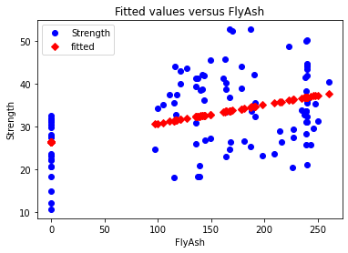
    


## Fit plot in seaborn
As in R, creating a better fit plot is a bit more work.  The central issue is that the observed and predicted axis must be identical for the reference line to be 45&deg;.  This can be done as follows:

1. Determine the min and max values for the observed values of _Y_
2. Predict values of _Y_
3. Create a plot showing the observed versus predicted values of _Y_. Save this to an object (in this case `ax`)
4. Modify the chart object so that the two axes share the same minimum and maximum values
5. Generate data on a 45&deg; line and add the reference line to the plot


```python
model_result.fittedvalues
```


    0      30.901424
    1      34.689565
    2      34.689565
    3      34.645517
    4      32.619302
             ...    
    98     36.808282
    99     36.843520
    100    36.830306
    101    36.843520
    102    36.103511
    Length: 103, dtype: float64


```python
Y_max = Y.max()
Y_min = Y.min()

ax = sns.scatterplot(x=model_result.fittedvalues, y=Y)
ax.set(ylim=(Y_min, Y_max))
ax.set(xlim=(Y_min, Y_max))
ax.set_xlabel("Predicted value of Strength")
ax.set_ylabel("Observed value of Strength")

X_ref = Y_ref = np.linspace(Y_min, Y_max, 100)
plt.plot(X_ref, Y_ref, color='red', linewidth=1)
plt.show()
```


    
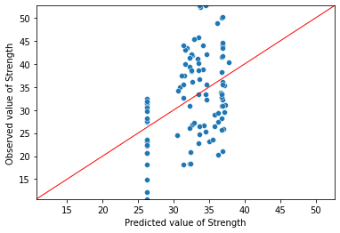
    


## Mutliple Regression

Before embarking on any multiple regression analysis, EDA should always be performed.

Here we will:

1. Compute summary statistics
2. Plot scatterplots, 2-by-2, of all explanatory variables against the response variable.


```python
con.describe()
```


<div>
<style scoped>
    .dataframe tbody tr th:only-of-type {
        vertical-align: middle;
    }

    .dataframe tbody tr th {
        vertical-align: top;
    }

    .dataframe thead th {
        text-align: right;
    }
</style>
<table border="1" class="dataframe">
  <thead>
    <tr style="text-align: right;">
      <th></th>
      <th>No</th>
      <th>Cement</th>
      <th>Slag</th>
      <th>FlyAsh</th>
      <th>Water</th>
      <th>SP</th>
      <th>CoarseAgg</th>
      <th>FineAgg</th>
      <th>Strength</th>
    </tr>
  </thead>
  <tbody>
    <tr>
      <th>count</th>
      <td>103.000000</td>
      <td>103.000000</td>
      <td>103.000000</td>
      <td>103.000000</td>
      <td>103.000000</td>
      <td>103.000000</td>
      <td>103.000000</td>
      <td>103.000000</td>
      <td>103.000000</td>
    </tr>
    <tr>
      <th>mean</th>
      <td>52.000000</td>
      <td>229.894175</td>
      <td>77.973786</td>
      <td>149.014563</td>
      <td>197.167961</td>
      <td>8.539806</td>
      <td>883.978641</td>
      <td>739.604854</td>
      <td>32.840184</td>
    </tr>
    <tr>
      <th>std</th>
      <td>29.877528</td>
      <td>78.877230</td>
      <td>60.461363</td>
      <td>85.418080</td>
      <td>20.208158</td>
      <td>2.807530</td>
      <td>88.391393</td>
      <td>63.342117</td>
      <td>9.258437</td>
    </tr>
    <tr>
      <th>min</th>
      <td>1.000000</td>
      <td>137.000000</td>
      <td>0.000000</td>
      <td>0.000000</td>
      <td>160.000000</td>
      <td>4.400000</td>
      <td>708.000000</td>
      <td>640.600000</td>
      <td>10.685000</td>
    </tr>
    <tr>
      <th>25%</th>
      <td>26.500000</td>
      <td>152.000000</td>
      <td>0.050000</td>
      <td>115.500000</td>
      <td>180.000000</td>
      <td>6.000000</td>
      <td>819.500000</td>
      <td>684.500000</td>
      <td>26.220000</td>
    </tr>
    <tr>
      <th>50%</th>
      <td>52.000000</td>
      <td>248.000000</td>
      <td>100.000000</td>
      <td>164.000000</td>
      <td>196.000000</td>
      <td>8.000000</td>
      <td>879.000000</td>
      <td>742.700000</td>
      <td>32.710000</td>
    </tr>
    <tr>
      <th>75%</th>
      <td>77.500000</td>
      <td>303.900000</td>
      <td>125.000000</td>
      <td>235.950000</td>
      <td>209.500000</td>
      <td>10.000000</td>
      <td>952.800000</td>
      <td>788.000000</td>
      <td>40.065000</td>
    </tr>
    <tr>
      <th>max</th>
      <td>103.000000</td>
      <td>374.000000</td>
      <td>193.000000</td>
      <td>260.000000</td>
      <td>240.000000</td>
      <td>19.000000</td>
      <td>1049.900000</td>
      <td>902.000000</td>
      <td>52.650000</td>
    </tr>
  </tbody>
</table>
</div>


```python
for c in con.columns[:-1]:
    plt.figure(figsize=(8,5))
    plt.title("{} vs. \nConcrete Compressive Strength".format(c),fontsize=16)
    plt.scatter(x=con[c],y=con['Strength'],color='blue',edgecolor='k')
    plt.grid(True)
    plt.xlabel(c,fontsize=14)
    plt.ylabel('Concrete compressive strength\n(MPa, megapascals)',fontsize=14)
    plt.show()
```


    

    


    

    


    

    


    

    


    
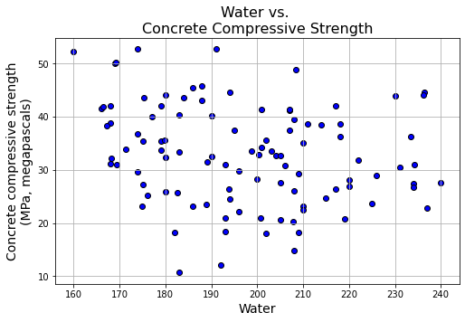
    


    
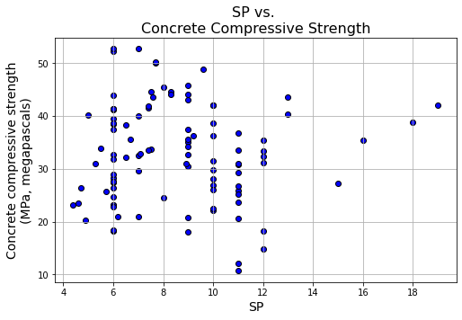
    


    
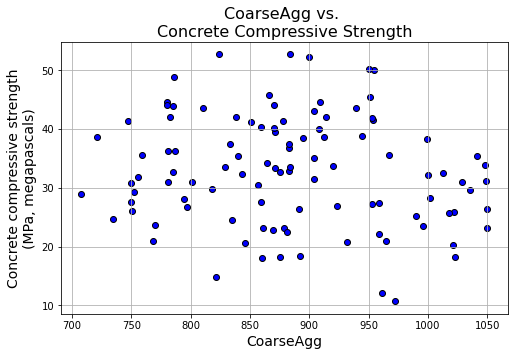
    


    

    


    
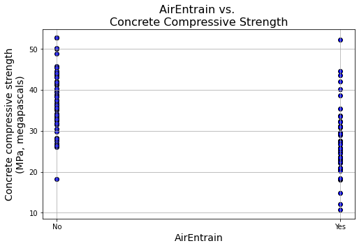
    


## Data Preparation for Regression


Once again, define two separate data frames:
1. _Y_ to hold the response variable (the single column "Strength")
2. _X_ to hold all the explanatory variables

Note that we have excluded "AirEntrain" at this point because it is categorical. Including categorical variables in a linear regression requires some additional work.


```python
Y = con['Strength']
X = con[['No',
 'Cement',
 'Slag',
 'FlyAsh',
 'Water',
 'SP',
 'CoarseAgg',
 'FineAgg']]
X = sm.add_constant(X)
X.head()
```


<div>
<style scoped>
    .dataframe tbody tr th:only-of-type {
        vertical-align: middle;
    }

    .dataframe tbody tr th {
        vertical-align: top;
    }

    .dataframe thead th {
        text-align: right;
    }
</style>
<table border="1" class="dataframe">
  <thead>
    <tr style="text-align: right;">
      <th></th>
      <th>const</th>
      <th>No</th>
      <th>Cement</th>
      <th>Slag</th>
      <th>FlyAsh</th>
      <th>Water</th>
      <th>SP</th>
      <th>CoarseAgg</th>
      <th>FineAgg</th>
    </tr>
  </thead>
  <tbody>
    <tr>
      <th>0</th>
      <td>1.0</td>
      <td>1</td>
      <td>273.0</td>
      <td>82.0</td>
      <td>105.0</td>
      <td>210.0</td>
      <td>9.0</td>
      <td>904.0</td>
      <td>680.0</td>
    </tr>
    <tr>
      <th>1</th>
      <td>1.0</td>
      <td>2</td>
      <td>163.0</td>
      <td>149.0</td>
      <td>191.0</td>
      <td>180.0</td>
      <td>12.0</td>
      <td>843.0</td>
      <td>746.0</td>
    </tr>
    <tr>
      <th>2</th>
      <td>1.0</td>
      <td>3</td>
      <td>162.0</td>
      <td>148.0</td>
      <td>191.0</td>
      <td>179.0</td>
      <td>16.0</td>
      <td>840.0</td>
      <td>743.0</td>
    </tr>
    <tr>
      <th>3</th>
      <td>1.0</td>
      <td>4</td>
      <td>162.0</td>
      <td>148.0</td>
      <td>190.0</td>
      <td>179.0</td>
      <td>19.0</td>
      <td>838.0</td>
      <td>741.0</td>
    </tr>
    <tr>
      <th>4</th>
      <td>1.0</td>
      <td>5</td>
      <td>154.0</td>
      <td>112.0</td>
      <td>144.0</td>
      <td>220.0</td>
      <td>10.0</td>
      <td>923.0</td>
      <td>658.0</td>
    </tr>
  </tbody>
</table>
</div>


## Kitchen sink model

Usual practice is to start with a "kitchen sink" model, which includes **all** the (numerical) explanatory variables. 

The Statsmodels OLS output gives us some warnings at the bottom of the output.  These concern collinearity, due to nuisance variables that should eventually be eliminated, or shrunken-see below. We can ignore these at this early stage of the modeling process.


```python
ks = sm.OLS(Y, X)
ks_res =ks.fit()
ks_res.summary()
```


<table class="simpletable">
<caption>OLS Regression Results</caption>
<tr>
  <th>Dep. Variable:</th>        <td>Strength</td>     <th>  R-squared:         </th> <td>   0.827</td>
</tr>
<tr>
  <th>Model:</th>                   <td>OLS</td>       <th>  Adj. R-squared:    </th> <td>   0.812</td>
</tr>
<tr>
  <th>Method:</th>             <td>Least Squares</td>  <th>  F-statistic:       </th> <td>   56.21</td>
</tr>
<tr>
  <th>Date:</th>             <td>Sun, 10 Sep 2023</td> <th>  Prob (F-statistic):</th> <td>1.68e-32</td>
</tr>
<tr>
  <th>Time:</th>                 <td>12:21:46</td>     <th>  Log-Likelihood:    </th> <td> -284.49</td>
</tr>
<tr>
  <th>No. Observations:</th>      <td>   103</td>      <th>  AIC:               </th> <td>   587.0</td>
</tr>
<tr>
  <th>Df Residuals:</th>          <td>    94</td>      <th>  BIC:               </th> <td>   610.7</td>
</tr>
<tr>
  <th>Df Model:</th>              <td>     8</td>      <th>                     </th>     <td> </td>   
</tr>
<tr>
  <th>Covariance Type:</th>      <td>nonrobust</td>    <th>                     </th>     <td> </td>   
</tr>
</table>
<table class="simpletable">
<tr>
      <td></td>         <th>coef</th>     <th>std err</th>      <th>t</th>      <th>P>|t|</th>  <th>[0.025</th>    <th>0.975]</th>  
</tr>
<tr>
  <th>const</th>     <td>  115.2834</td> <td>  142.786</td> <td>    0.807</td> <td> 0.421</td> <td> -168.222</td> <td>  398.789</td>
</tr>
<tr>
  <th>No</th>        <td>   -0.0077</td> <td>    0.021</td> <td>   -0.372</td> <td> 0.711</td> <td>   -0.049</td> <td>    0.033</td>
</tr>
<tr>
  <th>Cement</th>    <td>    0.0826</td> <td>    0.047</td> <td>    1.758</td> <td> 0.082</td> <td>   -0.011</td> <td>    0.176</td>
</tr>
<tr>
  <th>Slag</th>      <td>   -0.0225</td> <td>    0.065</td> <td>   -0.346</td> <td> 0.730</td> <td>   -0.152</td> <td>    0.107</td>
</tr>
<tr>
  <th>FlyAsh</th>    <td>    0.0668</td> <td>    0.048</td> <td>    1.380</td> <td> 0.171</td> <td>   -0.029</td> <td>    0.163</td>
</tr>
<tr>
  <th>Water</th>     <td>   -0.2165</td> <td>    0.142</td> <td>   -1.520</td> <td> 0.132</td> <td>   -0.499</td> <td>    0.066</td>
</tr>
<tr>
  <th>SP</th>        <td>    0.2518</td> <td>    0.213</td> <td>    1.181</td> <td> 0.241</td> <td>   -0.172</td> <td>    0.675</td>
</tr>
<tr>
  <th>CoarseAgg</th> <td>   -0.0479</td> <td>    0.056</td> <td>   -0.857</td> <td> 0.393</td> <td>   -0.159</td> <td>    0.063</td>
</tr>
<tr>
  <th>FineAgg</th>   <td>   -0.0356</td> <td>    0.057</td> <td>   -0.622</td> <td> 0.536</td> <td>   -0.149</td> <td>    0.078</td>
</tr>
</table>
<table class="simpletable">
<tr>
  <th>Omnibus:</th>       <td> 2.168</td> <th>  Durbin-Watson:     </th> <td>   1.715</td>
</tr>
<tr>
  <th>Prob(Omnibus):</th> <td> 0.338</td> <th>  Jarque-Bera (JB):  </th> <td>   2.183</td>
</tr>
<tr>
  <th>Skew:</th>          <td>-0.309</td> <th>  Prob(JB):          </th> <td>   0.336</td>
</tr>
<tr>
  <th>Kurtosis:</th>      <td> 2.644</td> <th>  Cond. No.          </th> <td>4.36e+05</td>
</tr>
</table><br/><br/>Notes:<br/>[1] Standard Errors assume that the covariance matrix of the errors is correctly specified.<br/>[2] The condition number is large, 4.36e+05. This might indicate that there are<br/>strong multicollinearity or other numerical problems.


## Categorical explanatory variables

To deal with categorical explanatory variables in **R**, we need to convert the variable to a _factor_ data type and let R construct the _n_-1 dummy columns behind the scenes.

In Python, we can use either the manual approach (create a matrix of dummy variables ourselves) or the automatic approach (let the algorithm sort it out behind the scenes).  We recommend the manual approach because dealing intelligently with categorical variables in real-world data _almost always_ involves significant work.  

Specifically: we typically need to change the granularity of the variable to provide more generalizable results.

### Create a matrix of dummy variables

Many different libraries in Python provide many different routines for encoding categorical variables.  All of these routines bypass the drudgery of writing IF statements to map from categorical values to (0, 1) values.  Here we will use Pandas's aptly-named `get_dummies()` method.

In this approach, we pass `get_dummies()` a column in a data frame and it creates a full matrix of zero-one values--this is also knwon as **one-hot encoding**.  In other words, it gives us a matrix with 103 rows (because we have 103 rows in the "Concrete Strength" data set and two columns (because the "AirEntrain" variable has two values: Yes and No).


```python
AirEntrain_d = pd.get_dummies(con['AirEntrain'])
AirEntrain_d
```


<div>
<style scoped>
    .dataframe tbody tr th:only-of-type {
        vertical-align: middle;
    }

    .dataframe tbody tr th {
        vertical-align: top;
    }

    .dataframe thead th {
        text-align: right;
    }
</style>
<table border="1" class="dataframe">
  <thead>
    <tr style="text-align: right;">
      <th></th>
      <th>No</th>
      <th>Yes</th>
    </tr>
  </thead>
  <tbody>
    <tr>
      <th>0</th>
      <td>1</td>
      <td>0</td>
    </tr>
    <tr>
      <th>1</th>
      <td>0</td>
      <td>1</td>
    </tr>
    <tr>
      <th>2</th>
      <td>0</td>
      <td>1</td>
    </tr>
    <tr>
      <th>3</th>
      <td>1</td>
      <td>0</td>
    </tr>
    <tr>
      <th>4</th>
      <td>1</td>
      <td>0</td>
    </tr>
    <tr>
      <th>...</th>
      <td>...</td>
      <td>...</td>
    </tr>
    <tr>
      <th>98</th>
      <td>1</td>
      <td>0</td>
    </tr>
    <tr>
      <th>99</th>
      <td>1</td>
      <td>0</td>
    </tr>
    <tr>
      <th>100</th>
      <td>0</td>
      <td>1</td>
    </tr>
    <tr>
      <th>101</th>
      <td>0</td>
      <td>1</td>
    </tr>
    <tr>
      <th>102</th>
      <td>1</td>
      <td>0</td>
    </tr>
  </tbody>
</table>
<p>103 rows × 2 columns</p>
</div>


The "Yes" and "No" column headings can be problematic, especially if we have to convert many categorical variables with Yes/No values.  Accordingly, we need to make some changes to the default dummy matrix:

1. We use AirEntrain=No as the baseline for the dummy variable.  As such, we need to drop the "No" column from the matrix before passing it to the regression.
2. We can embed the choice of baseline into the the dummy column names. This makes it easier to interpret the regression coefficients


```python
AirEntrain_d.drop(columns='No', inplace=True)
AirEntrain_d.rename(columns={'Yes': 'AirEntrain_Yes'}, inplace=True)
AirEntrain_d.head(3)
```


<div>
<style scoped>
    .dataframe tbody tr th:only-of-type {
        vertical-align: middle;
    }

    .dataframe tbody tr th {
        vertical-align: top;
    }

    .dataframe thead th {
        text-align: right;
    }
</style>
<table border="1" class="dataframe">
  <thead>
    <tr style="text-align: right;">
      <th></th>
      <th>AirEntrain_Yes</th>
    </tr>
  </thead>
  <tbody>
    <tr>
      <th>0</th>
      <td>0</td>
    </tr>
    <tr>
      <th>1</th>
      <td>1</td>
    </tr>
    <tr>
      <th>2</th>
      <td>1</td>
    </tr>
  </tbody>
</table>
</div>


### Adding the dummy columns to the existing _X_ matrix


```python
fullX = pd.concat([X, AirEntrain_d['AirEntrain_Yes']], axis=1)
fullX.head()
```


<div>
<style scoped>
    .dataframe tbody tr th:only-of-type {
        vertical-align: middle;
    }

    .dataframe tbody tr th {
        vertical-align: top;
    }

    .dataframe thead th {
        text-align: right;
    }
</style>
<table border="1" class="dataframe">
  <thead>
    <tr style="text-align: right;">
      <th></th>
      <th>const</th>
      <th>No</th>
      <th>Cement</th>
      <th>Slag</th>
      <th>FlyAsh</th>
      <th>Water</th>
      <th>SP</th>
      <th>CoarseAgg</th>
      <th>FineAgg</th>
      <th>AirEntrain_Yes</th>
    </tr>
  </thead>
  <tbody>
    <tr>
      <th>0</th>
      <td>1.0</td>
      <td>1</td>
      <td>273.0</td>
      <td>82.0</td>
      <td>105.0</td>
      <td>210.0</td>
      <td>9.0</td>
      <td>904.0</td>
      <td>680.0</td>
      <td>0</td>
    </tr>
    <tr>
      <th>1</th>
      <td>1.0</td>
      <td>2</td>
      <td>163.0</td>
      <td>149.0</td>
      <td>191.0</td>
      <td>180.0</td>
      <td>12.0</td>
      <td>843.0</td>
      <td>746.0</td>
      <td>1</td>
    </tr>
    <tr>
      <th>2</th>
      <td>1.0</td>
      <td>3</td>
      <td>162.0</td>
      <td>148.0</td>
      <td>191.0</td>
      <td>179.0</td>
      <td>16.0</td>
      <td>840.0</td>
      <td>743.0</td>
      <td>1</td>
    </tr>
    <tr>
      <th>3</th>
      <td>1.0</td>
      <td>4</td>
      <td>162.0</td>
      <td>148.0</td>
      <td>190.0</td>
      <td>179.0</td>
      <td>19.0</td>
      <td>838.0</td>
      <td>741.0</td>
      <td>0</td>
    </tr>
    <tr>
      <th>4</th>
      <td>1.0</td>
      <td>5</td>
      <td>154.0</td>
      <td>112.0</td>
      <td>144.0</td>
      <td>220.0</td>
      <td>10.0</td>
      <td>923.0</td>
      <td>658.0</td>
      <td>0</td>
    </tr>
  </tbody>
</table>
</div>


### Running the full regression

We can now rerun the regression, including the categorical variable.


```python
ks2 = sm.OLS(Y, fullX)
ks2_res = ks2.fit()
ks2_res.summary()
```


<table class="simpletable">
<caption>OLS Regression Results</caption>
<tr>
  <th>Dep. Variable:</th>        <td>Strength</td>     <th>  R-squared:         </th> <td>   0.924</td>
</tr>
<tr>
  <th>Model:</th>                   <td>OLS</td>       <th>  Adj. R-squared:    </th> <td>   0.916</td>
</tr>
<tr>
  <th>Method:</th>             <td>Least Squares</td>  <th>  F-statistic:       </th> <td>   125.1</td>
</tr>
<tr>
  <th>Date:</th>             <td>Sun, 10 Sep 2023</td> <th>  Prob (F-statistic):</th> <td>5.83e-48</td>
</tr>
<tr>
  <th>Time:</th>                 <td>12:21:46</td>     <th>  Log-Likelihood:    </th> <td> -242.38</td>
</tr>
<tr>
  <th>No. Observations:</th>      <td>   103</td>      <th>  AIC:               </th> <td>   504.8</td>
</tr>
<tr>
  <th>Df Residuals:</th>          <td>    93</td>      <th>  BIC:               </th> <td>   531.1</td>
</tr>
<tr>
  <th>Df Model:</th>              <td>     9</td>      <th>                     </th>     <td> </td>   
</tr>
<tr>
  <th>Covariance Type:</th>      <td>nonrobust</td>    <th>                     </th>     <td> </td>   
</tr>
</table>
<table class="simpletable">
<tr>
         <td></td>           <th>coef</th>     <th>std err</th>      <th>t</th>      <th>P>|t|</th>  <th>[0.025</th>    <th>0.975]</th>  
</tr>
<tr>
  <th>const</th>          <td>   41.5005</td> <td>   95.617</td> <td>    0.434</td> <td> 0.665</td> <td> -148.375</td> <td>  231.376</td>
</tr>
<tr>
  <th>No</th>             <td>   -0.0173</td> <td>    0.014</td> <td>   -1.251</td> <td> 0.214</td> <td>   -0.045</td> <td>    0.010</td>
</tr>
<tr>
  <th>Cement</th>         <td>    0.0962</td> <td>    0.031</td> <td>    3.063</td> <td> 0.003</td> <td>    0.034</td> <td>    0.159</td>
</tr>
<tr>
  <th>Slag</th>           <td>    0.0157</td> <td>    0.044</td> <td>    0.359</td> <td> 0.720</td> <td>   -0.071</td> <td>    0.102</td>
</tr>
<tr>
  <th>FlyAsh</th>         <td>    0.0869</td> <td>    0.032</td> <td>    2.684</td> <td> 0.009</td> <td>    0.023</td> <td>    0.151</td>
</tr>
<tr>
  <th>Water</th>          <td>   -0.1380</td> <td>    0.095</td> <td>   -1.446</td> <td> 0.151</td> <td>   -0.328</td> <td>    0.051</td>
</tr>
<tr>
  <th>SP</th>             <td>    0.1902</td> <td>    0.143</td> <td>    1.334</td> <td> 0.186</td> <td>   -0.093</td> <td>    0.473</td>
</tr>
<tr>
  <th>CoarseAgg</th>      <td>   -0.0160</td> <td>    0.037</td> <td>   -0.428</td> <td> 0.669</td> <td>   -0.090</td> <td>    0.058</td>
</tr>
<tr>
  <th>FineAgg</th>        <td>   -0.0021</td> <td>    0.038</td> <td>   -0.053</td> <td> 0.957</td> <td>   -0.078</td> <td>    0.074</td>
</tr>
<tr>
  <th>AirEntrain_Yes</th> <td>   -6.0683</td> <td>    0.559</td> <td>  -10.848</td> <td> 0.000</td> <td>   -7.179</td> <td>   -4.957</td>
</tr>
</table>
<table class="simpletable">
<tr>
  <th>Omnibus:</th>       <td> 4.217</td> <th>  Durbin-Watson:     </th> <td>   1.637</td>
</tr>
<tr>
  <th>Prob(Omnibus):</th> <td> 0.121</td> <th>  Jarque-Bera (JB):  </th> <td>   3.635</td>
</tr>
<tr>
  <th>Skew:</th>          <td> 0.351</td> <th>  Prob(JB):          </th> <td>   0.162</td>
</tr>
<tr>
  <th>Kurtosis:</th>      <td> 3.594</td> <th>  Cond. No.          </th> <td>4.37e+05</td>
</tr>
</table><br/><br/>Notes:<br/>[1] Standard Errors assume that the covariance matrix of the errors is correctly specified.<br/>[2] The condition number is large, 4.37e+05. This might indicate that there are<br/>strong multicollinearity or other numerical problems.


 
 We observe that:
 
 1. The R-squared value has improved considerably and is now equal to 0.924.
 2. There is still a problem with collinearity.

## Using R-like formulas

As mentioned previously, R was used in statistics long before Python was popular.  As a consequence, some of the data science libraries for Python mimic the R way of doing things.  This makes it much easier for people who know R to transition to Python.  If, however, you do not know R, it can add some confusion.

Having said this, formula notation in R turns out to be very useful.  Instead of defining separate _Y_ and _X_ matrices, we simply pass R a formula of the form "Y ~ X1, X2, ... Xn" and it takes care of the rest.  It turns out that Statsmodels includes a whole library for doing things the R way.  Two things to know:

1. You have to import the statsmodels.formula.api library instead of (or, more typically, in addition to) the statsmodels.api library
2. The method names in the "formula" api are lowercase (e.g., `ols()` instead of `OLS()`

Let us do this now, in "R" style.


```python
import statsmodels.formula.api as smf
ksf =  smf.ols(' Strength ~ No + Cement + Slag + Water + CoarseAgg + FlyAsh + SP + FineAgg + AirEntrain', data=con)
ksf_res = ksf.fit()
ksf_res.summary()
```


<table class="simpletable">
<caption>OLS Regression Results</caption>
<tr>
  <th>Dep. Variable:</th>        <td>Strength</td>     <th>  R-squared:         </th> <td>   0.924</td>
</tr>
<tr>
  <th>Model:</th>                   <td>OLS</td>       <th>  Adj. R-squared:    </th> <td>   0.916</td>
</tr>
<tr>
  <th>Method:</th>             <td>Least Squares</td>  <th>  F-statistic:       </th> <td>   125.1</td>
</tr>
<tr>
  <th>Date:</th>             <td>Sun, 10 Sep 2023</td> <th>  Prob (F-statistic):</th> <td>5.83e-48</td>
</tr>
<tr>
  <th>Time:</th>                 <td>12:21:46</td>     <th>  Log-Likelihood:    </th> <td> -242.38</td>
</tr>
<tr>
  <th>No. Observations:</th>      <td>   103</td>      <th>  AIC:               </th> <td>   504.8</td>
</tr>
<tr>
  <th>Df Residuals:</th>          <td>    93</td>      <th>  BIC:               </th> <td>   531.1</td>
</tr>
<tr>
  <th>Df Model:</th>              <td>     9</td>      <th>                     </th>     <td> </td>   
</tr>
<tr>
  <th>Covariance Type:</th>      <td>nonrobust</td>    <th>                     </th>     <td> </td>   
</tr>
</table>
<table class="simpletable">
<tr>
          <td></td>             <th>coef</th>     <th>std err</th>      <th>t</th>      <th>P>|t|</th>  <th>[0.025</th>    <th>0.975]</th>  
</tr>
<tr>
  <th>Intercept</th>         <td>   41.5005</td> <td>   95.617</td> <td>    0.434</td> <td> 0.665</td> <td> -148.375</td> <td>  231.376</td>
</tr>
<tr>
  <th>AirEntrain[T.Yes]</th> <td>   -6.0683</td> <td>    0.559</td> <td>  -10.848</td> <td> 0.000</td> <td>   -7.179</td> <td>   -4.957</td>
</tr>
<tr>
  <th>No</th>                <td>   -0.0173</td> <td>    0.014</td> <td>   -1.251</td> <td> 0.214</td> <td>   -0.045</td> <td>    0.010</td>
</tr>
<tr>
  <th>Cement</th>            <td>    0.0962</td> <td>    0.031</td> <td>    3.063</td> <td> 0.003</td> <td>    0.034</td> <td>    0.159</td>
</tr>
<tr>
  <th>Slag</th>              <td>    0.0157</td> <td>    0.044</td> <td>    0.359</td> <td> 0.720</td> <td>   -0.071</td> <td>    0.102</td>
</tr>
<tr>
  <th>Water</th>             <td>   -0.1380</td> <td>    0.095</td> <td>   -1.446</td> <td> 0.151</td> <td>   -0.328</td> <td>    0.051</td>
</tr>
<tr>
  <th>CoarseAgg</th>         <td>   -0.0160</td> <td>    0.037</td> <td>   -0.428</td> <td> 0.669</td> <td>   -0.090</td> <td>    0.058</td>
</tr>
<tr>
  <th>FlyAsh</th>            <td>    0.0869</td> <td>    0.032</td> <td>    2.684</td> <td> 0.009</td> <td>    0.023</td> <td>    0.151</td>
</tr>
<tr>
  <th>SP</th>                <td>    0.1902</td> <td>    0.143</td> <td>    1.334</td> <td> 0.186</td> <td>   -0.093</td> <td>    0.473</td>
</tr>
<tr>
  <th>FineAgg</th>           <td>   -0.0021</td> <td>    0.038</td> <td>   -0.053</td> <td> 0.957</td> <td>   -0.078</td> <td>    0.074</td>
</tr>
</table>
<table class="simpletable">
<tr>
  <th>Omnibus:</th>       <td> 4.217</td> <th>  Durbin-Watson:     </th> <td>   1.637</td>
</tr>
<tr>
  <th>Prob(Omnibus):</th> <td> 0.121</td> <th>  Jarque-Bera (JB):  </th> <td>   3.635</td>
</tr>
<tr>
  <th>Skew:</th>          <td> 0.351</td> <th>  Prob(JB):          </th> <td>   0.162</td>
</tr>
<tr>
  <th>Kurtosis:</th>      <td> 3.594</td> <th>  Cond. No.          </th> <td>4.37e+05</td>
</tr>
</table><br/><br/>Notes:<br/>[1] Standard Errors assume that the covariance matrix of the errors is correctly specified.<br/>[2] The condition number is large, 4.37e+05. This might indicate that there are<br/>strong multicollinearity or other numerical problems.


## Checking for colinearity

### Scatterplot matrix

We can plot scatterplot matrix on our original _X_ matrix using Seaborn's handy `pairplot()` method. A nice feature of this presentation is a histogram for each variable. **Note** that this may take a few seconds to generate so you  have to be patient. 


```python
import seaborn as sns
sns.pairplot(X);
```


    

    


### Restricting variables in the scatterplot matrix

With wide data sets (having many columns), the scatterplots become unreadable.  Thus, it is often better to restrict the variables in the scatterplot matrix to a named set in order to maximize readability.  Here we exclud the constant, response variable, and all dummy columns.

A few things that catch the eye in the scatterplot matrix:

1. The "No" variable (experiment number) does not appear to be correlated with any other variable.  That is good news&mdash;we should not expect it to in a well-run experiment.
2. There is some linearity and other strangeness in the relationships between "FlyAsh", "Slag", and "Cement". This suggests problems with the experimental design. Unfortunately, these problems cannot be fixed in the data analysis stage.


```python
sns.pairplot(X[['No',
 'Cement',
 'Slag',
 'FlyAsh',
 'Water',
 'SP',
 'CoarseAgg',
 'FineAgg']]);
```


    

    


### Correlation matrix

If the scatterplot matrix remains too hard to read, one can always revert to a simple correlation matrix.


```python
round(con.corr(),2)
```


<div>
<style scoped>
    .dataframe tbody tr th:only-of-type {
        vertical-align: middle;
    }

    .dataframe tbody tr th {
        vertical-align: top;
    }

    .dataframe thead th {
        text-align: right;
    }
</style>
<table border="1" class="dataframe">
  <thead>
    <tr style="text-align: right;">
      <th></th>
      <th>No</th>
      <th>Cement</th>
      <th>Slag</th>
      <th>FlyAsh</th>
      <th>Water</th>
      <th>SP</th>
      <th>CoarseAgg</th>
      <th>FineAgg</th>
      <th>Strength</th>
    </tr>
  </thead>
  <tbody>
    <tr>
      <th>No</th>
      <td>1.00</td>
      <td>-0.03</td>
      <td>-0.08</td>
      <td>0.34</td>
      <td>-0.14</td>
      <td>-0.33</td>
      <td>0.22</td>
      <td>-0.31</td>
      <td>0.19</td>
    </tr>
    <tr>
      <th>Cement</th>
      <td>-0.03</td>
      <td>1.00</td>
      <td>-0.24</td>
      <td>-0.49</td>
      <td>0.22</td>
      <td>-0.11</td>
      <td>-0.31</td>
      <td>0.06</td>
      <td>0.46</td>
    </tr>
    <tr>
      <th>Slag</th>
      <td>-0.08</td>
      <td>-0.24</td>
      <td>1.00</td>
      <td>-0.32</td>
      <td>-0.03</td>
      <td>0.31</td>
      <td>-0.22</td>
      <td>-0.18</td>
      <td>-0.33</td>
    </tr>
    <tr>
      <th>FlyAsh</th>
      <td>0.34</td>
      <td>-0.49</td>
      <td>-0.32</td>
      <td>1.00</td>
      <td>-0.24</td>
      <td>-0.14</td>
      <td>0.17</td>
      <td>-0.28</td>
      <td>0.41</td>
    </tr>
    <tr>
      <th>Water</th>
      <td>-0.14</td>
      <td>0.22</td>
      <td>-0.03</td>
      <td>-0.24</td>
      <td>1.00</td>
      <td>-0.16</td>
      <td>-0.60</td>
      <td>0.11</td>
      <td>-0.22</td>
    </tr>
    <tr>
      <th>SP</th>
      <td>-0.33</td>
      <td>-0.11</td>
      <td>0.31</td>
      <td>-0.14</td>
      <td>-0.16</td>
      <td>1.00</td>
      <td>-0.10</td>
      <td>0.06</td>
      <td>-0.02</td>
    </tr>
    <tr>
      <th>CoarseAgg</th>
      <td>0.22</td>
      <td>-0.31</td>
      <td>-0.22</td>
      <td>0.17</td>
      <td>-0.60</td>
      <td>-0.10</td>
      <td>1.00</td>
      <td>-0.49</td>
      <td>-0.15</td>
    </tr>
    <tr>
      <th>FineAgg</th>
      <td>-0.31</td>
      <td>0.06</td>
      <td>-0.18</td>
      <td>-0.28</td>
      <td>0.11</td>
      <td>0.06</td>
      <td>-0.49</td>
      <td>1.00</td>
      <td>-0.17</td>
    </tr>
    <tr>
      <th>Strength</th>
      <td>0.19</td>
      <td>0.46</td>
      <td>-0.33</td>
      <td>0.41</td>
      <td>-0.22</td>
      <td>-0.02</td>
      <td>-0.15</td>
      <td>-0.17</td>
      <td>1.00</td>
    </tr>
  </tbody>
</table>
</div>


```python
corr = con[:-1].corr()
corr
from statsmodels.graphics.correlation import plot_corr
fig = plot_corr(corr,xnames=corr.columns)
```


    
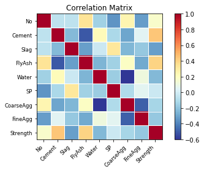
    


## Model Refinement and Feature Selection

The kitchen sink model is unlikely to be the best model.  At the very least, we need to remove variables that should not be in the model for **methodological** reasons, such as collinearity.  Then, depending on our philosophical view on such things, we can go into data mining mode and attempt to generate the "best" model by removing or adding explanatory variables. Two clarifications:

1. The **best** model is typically defined in terms of the trade-off between goodness of fit (e.g., $R^2$) and model complexity (the number of explanatory variables).  This trade-off provides the rationale for the _adjusted_ $R^2$ measure. Given two models with similar explanatory power, the one with the fewest explanatory variables is deemed better.  
2. **Data mining mode** means we suspend our knowledge about the underlying domain and instead focus on technical measures of explanatory power. In this mode, we keep our theories about cause and effect to ourselves: If the measure indicates a variable has explanatory power, we leave it in the model; if the measure indicates the variable has low explanatory power, we take it out of the model. Many different heuristic measures of explanatory power exist, including the _p_-value of the coefficient and the more sophistical measures (AIC, Mallows Cp) used by R.

These will be left to a later example.

### Manual stepwise refinement

When we do manual stepwise refinement, the heuristic is to start with the kitchen sink model and remove the variable with the highest _p_-value (probability of zero slope).

If we scroll up to the results of the kitchen sink model, we see that the variable with the highest _p_-value is "FineAgg". If we are using the matrix version of the `OLS()` method, we can drop the column from the _X_ matrix.


```python
X1 = fullX.drop(columns='FineAgg', inplace=False)
mod1 = sm.OLS(Y, X1)
mod1_res = mod1.fit()
mod1_res.summary()
```


<table class="simpletable">
<caption>OLS Regression Results</caption>
<tr>
  <th>Dep. Variable:</th>        <td>Strength</td>     <th>  R-squared:         </th> <td>   0.924</td>
</tr>
<tr>
  <th>Model:</th>                   <td>OLS</td>       <th>  Adj. R-squared:    </th> <td>   0.917</td>
</tr>
<tr>
  <th>Method:</th>             <td>Least Squares</td>  <th>  F-statistic:       </th> <td>   142.2</td>
</tr>
<tr>
  <th>Date:</th>             <td>Sun, 10 Sep 2023</td> <th>  Prob (F-statistic):</th> <td>4.73e-49</td>
</tr>
<tr>
  <th>Time:</th>                 <td>12:21:52</td>     <th>  Log-Likelihood:    </th> <td> -242.38</td>
</tr>
<tr>
  <th>No. Observations:</th>      <td>   103</td>      <th>  AIC:               </th> <td>   502.8</td>
</tr>
<tr>
  <th>Df Residuals:</th>          <td>    94</td>      <th>  BIC:               </th> <td>   526.5</td>
</tr>
<tr>
  <th>Df Model:</th>              <td>     8</td>      <th>                     </th>     <td> </td>   
</tr>
<tr>
  <th>Covariance Type:</th>      <td>nonrobust</td>    <th>                     </th>     <td> </td>   
</tr>
</table>
<table class="simpletable">
<tr>
         <td></td>           <th>coef</th>     <th>std err</th>      <th>t</th>      <th>P>|t|</th>  <th>[0.025</th>    <th>0.975]</th>  
</tr>
<tr>
  <th>const</th>          <td>   36.4097</td> <td>    8.674</td> <td>    4.197</td> <td> 0.000</td> <td>   19.186</td> <td>   53.633</td>
</tr>
<tr>
  <th>No</th>             <td>   -0.0178</td> <td>    0.011</td> <td>   -1.674</td> <td> 0.097</td> <td>   -0.039</td> <td>    0.003</td>
</tr>
<tr>
  <th>Cement</th>         <td>    0.0978</td> <td>    0.005</td> <td>   18.070</td> <td> 0.000</td> <td>    0.087</td> <td>    0.109</td>
</tr>
<tr>
  <th>Slag</th>           <td>    0.0180</td> <td>    0.006</td> <td>    2.819</td> <td> 0.006</td> <td>    0.005</td> <td>    0.031</td>
</tr>
<tr>
  <th>FlyAsh</th>         <td>    0.0887</td> <td>    0.005</td> <td>   17.367</td> <td> 0.000</td> <td>    0.079</td> <td>    0.099</td>
</tr>
<tr>
  <th>Water</th>          <td>   -0.1330</td> <td>    0.019</td> <td>   -7.131</td> <td> 0.000</td> <td>   -0.170</td> <td>   -0.096</td>
</tr>
<tr>
  <th>SP</th>             <td>    0.1950</td> <td>    0.109</td> <td>    1.791</td> <td> 0.077</td> <td>   -0.021</td> <td>    0.411</td>
</tr>
<tr>
  <th>CoarseAgg</th>      <td>   -0.0141</td> <td>    0.005</td> <td>   -2.964</td> <td> 0.004</td> <td>   -0.023</td> <td>   -0.005</td>
</tr>
<tr>
  <th>AirEntrain_Yes</th> <td>   -6.0707</td> <td>    0.555</td> <td>  -10.946</td> <td> 0.000</td> <td>   -7.172</td> <td>   -4.970</td>
</tr>
</table>
<table class="simpletable">
<tr>
  <th>Omnibus:</th>       <td> 4.255</td> <th>  Durbin-Watson:     </th> <td>   1.637</td>
</tr>
<tr>
  <th>Prob(Omnibus):</th> <td> 0.119</td> <th>  Jarque-Bera (JB):  </th> <td>   3.680</td>
</tr>
<tr>
  <th>Skew:</th>          <td> 0.352</td> <th>  Prob(JB):          </th> <td>   0.159</td>
</tr>
<tr>
  <th>Kurtosis:</th>      <td> 3.601</td> <th>  Cond. No.          </th> <td>3.15e+04</td>
</tr>
</table><br/><br/>Notes:<br/>[1] Standard Errors assume that the covariance matrix of the errors is correctly specified.<br/>[2] The condition number is large, 3.15e+04. This might indicate that there are<br/>strong multicollinearity or other numerical problems.


## Regression diagnostics

As we did above for simple regression, we can generate  diagnostic plots to determine whether the resulting regression model is valid.


```python
from scipy import stats
sns.distplot(mod1_res.resid, fit=stats.norm);
```

    /Users/markasch/opt/anaconda3/lib/python3.9/site-packages/seaborn/distributions.py:2619: FutureWarning: `distplot` is a deprecated function and will be removed in a future version. Please adapt your code to use either `displot` (a figure-level function with similar flexibility) or `histplot` (an axes-level function for histograms).
      warnings.warn(msg, FutureWarning)


    

    


```python
sns.boxplot(x=mod1_res.resid, showmeans=True);
```


    

    


```python
sm.qqplot(mod1_res.resid, line='s');
```


    

    


We proceed, once again, to plot fitted vs. observed values.


```python
import matplotlib.pyplot as plt
import numpy as np

Y_max = Y.max()
Y_min = Y.min()

ax = sns.scatterplot(x=mod1_res.fittedvalues, y=Y)
ax.set(ylim=(Y_min, Y_max))
ax.set(xlim=(Y_min, Y_max))
ax.set_xlabel("Predicted value of Strength")
ax.set_ylabel("Observed value of Strength")

X_ref = Y_ref = np.linspace(Y_min, Y_max, 100)
plt.plot(X_ref, Y_ref, color='red', linewidth=1)
plt.show()
```


    
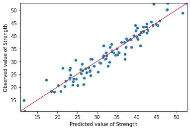
    


The improvement is considerable! Our model now captures, quite reliably, most of the range of compressive strength.

### Alternative diagnostic plots

We can plot individual residuals and overall fitted resiuduals.


```python
for c in X1.columns[1:-1]:
    plt.figure(figsize=(8,5))
    plt.title("{} vs. \nModel residuals".format(c),fontsize=16)
    plt.scatter(x=X1[c],y=mod1_res.resid,color='blue',edgecolor='k')
    plt.grid(True)
    xmin=min(X1[c])
    xmax = max(X1[c])
    plt.hlines(y=0,xmin=xmin*0.9,xmax=xmax*1.1,color='red',linestyle='--',lw=3)
    plt.xlabel(c,fontsize=14)
    plt.ylabel('Residuals',fontsize=14)
    plt.show()
```


    
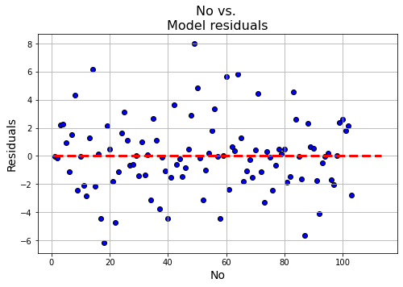
    


    

    


    

    


    

    


    
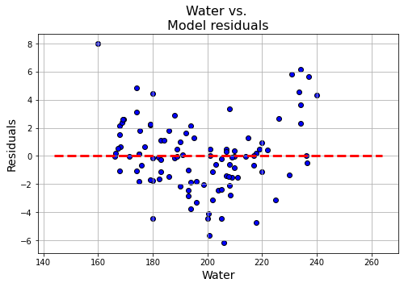
    


    
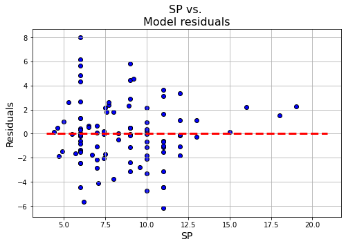
    


    
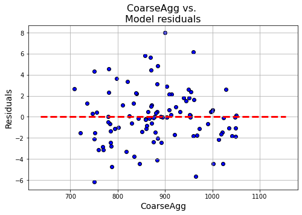
    


```python
plt.figure(figsize=(8,5))
p=plt.scatter(x=mod1_res.fittedvalues,y=mod1_res.resid,edgecolor='k')
xmin=min(mod1_res.fittedvalues)
xmax = max(mod1_res.fittedvalues)
plt.hlines(y=0,xmin=xmin*0.9,xmax=xmax*1.1,color='red',linestyle='--',lw=3)
plt.xlabel("Fitted values",fontsize=15)
plt.ylabel("Residuals",fontsize=15)
plt.title("Fitted vs. residuals plot",fontsize=18)
plt.grid(True)
plt.show()
```


    
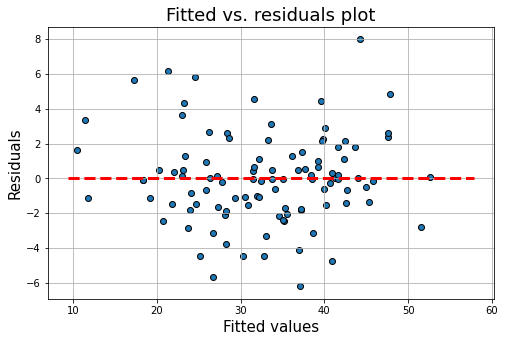
    


## Standardized regression coefficients
S
tandardized regression coefficients provide an easy way to estimate effect size that is independent of units.

Although extracting standardized coefficients is farily easy in R, we have to be a bit more explicit in Python:
1. Transform the _Y_ and each column of the _X_ matrices into standardize values (_z_-scores) with mean = 0 and standard deviation = 1.0.
2. Run the regression with the standardized inputs.  This provides standardized regression coefficients
3. Extract and display the standardized coefficient

### Creating standardized input matrices
We use the `zscore()` method from Scipy.  The only trick is that `zscore()` returns an array and we prefer to work with Pandas data frames (or series, for single-column data frames).  To get around this, we wrap the `zscore()` call inside the `Series()` constructor.  We pass the constructor the name of the original _Y_ series to keep everything the same.


```python
from scipy import stats
Y_norm = pd.Series(stats.zscore(Y), name=Y.name)
Y_norm.head(3)
```


    0    0.233336
    1   -0.061669
    2    0.283264
    Name: Strength, dtype: float64


The _X_ matrix is a bit trickier because the first column (the "const" column we created above) has zero variance&mdash;recall that it is just a column of 1's.  The definition of _z_-score is $$z = \frac{x - \bar{x}}{S}.$$  If there is no variance, the _z_-score is undefined and everything breaks.  To get around this, we do the following:
1. Create a new data frame called "X1_norm by using the Pandas `loc[]` function to select just a subset of columns. In the first line, I select all rows (:) and all columns where the column name is not equal to "const.
2. Apply the `zscore()` method to the entire "X1_norm" data frame.
3. Since we stripped the constant in the first line, add it back by recalling the `add_constant()` method
4. I apply the column names from my original "X1" data frame to the new "X1_norm" data frame
5. Perform a quick check to confirm the values for all explanatory variables are normalized with mean = 0 and (population) standard deviation = 1.


```python
X1_norm = X1.loc[:, X1.columns != "const"]
X1_norm = pd.DataFrame(stats.zscore(X1_norm))
X1_norm = sm.add_constant(X1_norm)
X1_norm.columns = X1.columns
check = pd.concat([round(X1_norm.mean(axis=0), 5), round(X1_norm.std(axis=0, ddof=0), 5)], axis=1)
check.columns=["mean", "std dev"]
check
```


<div>
<style scoped>
    .dataframe tbody tr th:only-of-type {
        vertical-align: middle;
    }

    .dataframe tbody tr th {
        vertical-align: top;
    }

    .dataframe thead th {
        text-align: right;
    }
</style>
<table border="1" class="dataframe">
  <thead>
    <tr style="text-align: right;">
      <th></th>
      <th>mean</th>
      <th>std dev</th>
    </tr>
  </thead>
  <tbody>
    <tr>
      <th>const</th>
      <td>1.0</td>
      <td>0.0</td>
    </tr>
    <tr>
      <th>No</th>
      <td>-0.0</td>
      <td>1.0</td>
    </tr>
    <tr>
      <th>Cement</th>
      <td>0.0</td>
      <td>1.0</td>
    </tr>
    <tr>
      <th>Slag</th>
      <td>0.0</td>
      <td>1.0</td>
    </tr>
    <tr>
      <th>FlyAsh</th>
      <td>0.0</td>
      <td>1.0</td>
    </tr>
    <tr>
      <th>Water</th>
      <td>-0.0</td>
      <td>1.0</td>
    </tr>
    <tr>
      <th>SP</th>
      <td>0.0</td>
      <td>1.0</td>
    </tr>
    <tr>
      <th>CoarseAgg</th>
      <td>0.0</td>
      <td>1.0</td>
    </tr>
    <tr>
      <th>AirEntrain_Yes</th>
      <td>0.0</td>
      <td>1.0</td>
    </tr>
  </tbody>
</table>
</div>


### Running the standardized regression
Once the standardized input matrices are in place, running a standardized regression is no different from running any other regression.  The difference is that we know the coefficients are now expressed  in terms of the number of standard deviations rather than kilograms, megapascals, and so on.


```python
modstd = sm.OLS(Y_norm, X1_norm)
modstd_res = modstd.fit()
modstd_res.summary()
```


<table class="simpletable">
<caption>OLS Regression Results</caption>
<tr>
  <th>Dep. Variable:</th>        <td>Strength</td>     <th>  R-squared:         </th> <td>   0.924</td>
</tr>
<tr>
  <th>Model:</th>                   <td>OLS</td>       <th>  Adj. R-squared:    </th> <td>   0.917</td>
</tr>
<tr>
  <th>Method:</th>             <td>Least Squares</td>  <th>  F-statistic:       </th> <td>   142.2</td>
</tr>
<tr>
  <th>Date:</th>             <td>Sun, 10 Sep 2023</td> <th>  Prob (F-statistic):</th> <td>4.73e-49</td>
</tr>
<tr>
  <th>Time:</th>                 <td>12:21:53</td>     <th>  Log-Likelihood:    </th> <td> -13.650</td>
</tr>
<tr>
  <th>No. Observations:</th>      <td>   103</td>      <th>  AIC:               </th> <td>   45.30</td>
</tr>
<tr>
  <th>Df Residuals:</th>          <td>    94</td>      <th>  BIC:               </th> <td>   69.01</td>
</tr>
<tr>
  <th>Df Model:</th>              <td>     8</td>      <th>                     </th>     <td> </td>   
</tr>
<tr>
  <th>Covariance Type:</th>      <td>nonrobust</td>    <th>                     </th>     <td> </td>   
</tr>
</table>
<table class="simpletable">
<tr>
         <td></td>           <th>coef</th>     <th>std err</th>      <th>t</th>      <th>P>|t|</th>  <th>[0.025</th>    <th>0.975]</th>  
</tr>
<tr>
  <th>const</th>          <td> 1.947e-16</td> <td>    0.028</td> <td> 6.83e-15</td> <td> 1.000</td> <td>   -0.057</td> <td>    0.057</td>
</tr>
<tr>
  <th>No</th>             <td>   -0.0575</td> <td>    0.034</td> <td>   -1.674</td> <td> 0.097</td> <td>   -0.126</td> <td>    0.011</td>
</tr>
<tr>
  <th>Cement</th>         <td>    0.8336</td> <td>    0.046</td> <td>   18.070</td> <td> 0.000</td> <td>    0.742</td> <td>    0.925</td>
</tr>
<tr>
  <th>Slag</th>           <td>    0.1175</td> <td>    0.042</td> <td>    2.819</td> <td> 0.006</td> <td>    0.035</td> <td>    0.200</td>
</tr>
<tr>
  <th>FlyAsh</th>         <td>    0.8180</td> <td>    0.047</td> <td>   17.367</td> <td> 0.000</td> <td>    0.724</td> <td>    0.911</td>
</tr>
<tr>
  <th>Water</th>          <td>   -0.2903</td> <td>    0.041</td> <td>   -7.131</td> <td> 0.000</td> <td>   -0.371</td> <td>   -0.209</td>
</tr>
<tr>
  <th>SP</th>             <td>    0.0591</td> <td>    0.033</td> <td>    1.791</td> <td> 0.077</td> <td>   -0.006</td> <td>    0.125</td>
</tr>
<tr>
  <th>CoarseAgg</th>      <td>   -0.1342</td> <td>    0.045</td> <td>   -2.964</td> <td> 0.004</td> <td>   -0.224</td> <td>   -0.044</td>
</tr>
<tr>
  <th>AirEntrain_Yes</th> <td>   -0.3282</td> <td>    0.030</td> <td>  -10.946</td> <td> 0.000</td> <td>   -0.388</td> <td>   -0.269</td>
</tr>
</table>
<table class="simpletable">
<tr>
  <th>Omnibus:</th>       <td> 4.255</td> <th>  Durbin-Watson:     </th> <td>   1.637</td>
</tr>
<tr>
  <th>Prob(Omnibus):</th> <td> 0.119</td> <th>  Jarque-Bera (JB):  </th> <td>   3.680</td>
</tr>
<tr>
  <th>Skew:</th>          <td> 0.352</td> <th>  Prob(JB):          </th> <td>   0.159</td>
</tr>
<tr>
  <th>Kurtosis:</th>      <td> 3.601</td> <th>  Cond. No.          </th> <td>    4.11</td>
</tr>
</table><br/><br/>Notes:<br/>[1] Standard Errors assume that the covariance matrix of the errors is correctly specified.


### Tornado diagram

Once we have the regression results, we can extract the coefficients using the `params` property and graph the standardized coefficients.  The only trick to getting a tornado diagram is that the coefficients have to be sorted in descending order by the _absolute value_ of the coefficient.  We resort to a bit of Python trickery to get the items in the desired order.  As before, we see that "Cement" and "FlyAsh" are the most important drivers of concrete strength.


```python
coeff = modstd_res.params
coeff = coeff.iloc[(coeff.abs()*-1.0).argsort()]
sns.barplot(x=coeff.values, y=coeff.index, orient='h');
```


    

    


### Conclusion

1. As before, we see that "Cement" and "FlyAsh" are the most important drivers of concrete strength.
2. The fitted model can now be used as a **surrogate** for analyzing, evaluating and predicting compressive strength for other compositions of the basic ingredients, as well as those of the process itself.

This is an excellent example of surrogate modeling in a real scientific context.
 


```python

```
