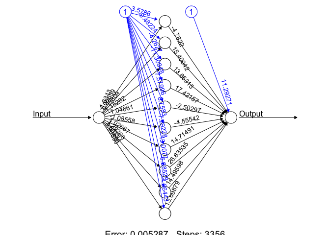

Let us consider a very elementary dataset, the squares of the whole
numbers from 0 to 10. We want to use these values to train a `neuralnet`
function in `R` that will learn the rule of squares.

We begin by loading the library and the data.

``` r
library("neuralnet")
# Read the data
mydata=read.csv("./squares.csv",sep=",",header=TRUE)
mydata
```

    ##    Input Output
    ## 1      0      0
    ## 2      1      1
    ## 3      2      4
    ## 4      3      9
    ## 5      4     16
    ## 6      5     25
    ## 7      6     36
    ## 8      7     49
    ## 9      8     64
    ## 10     9     81
    ## 11    10    100

``` r
attach(mydata)
names(mydata)
```

    ## [1] "Input"  "Output"

## Train the network

Our objective is to calculate the weights and the bias of a network that
knows how to compute squares. The arguments for the `neuralnet` function
are:

-   the column names of inputs and outputs,
-   the number of neurons in the hidden layer,
-   the stopping criterion `threshold`.

``` r
# Train the model from the inputs, based on the (known) output
model=neuralnet(formula = Output~Input, 
                data = mydata, 
                hidden=10, 
                threshold=0.01 )
print(model)
```

    ## $call
    ## neuralnet(formula = Output ~ Input, data = mydata, hidden = 10, 
    ##     threshold = 0.01)
    ## 
    ## $response
    ##    Output
    ## 1       0
    ## 2       1
    ## 3       4
    ## 4       9
    ## 5      16
    ## 6      25
    ## 7      36
    ## 8      49
    ## 9      64
    ## 10     81
    ## 11    100
    ## 
    ## $covariate
    ##         
    ##  [1,]  0
    ##  [2,]  1
    ##  [3,]  2
    ##  [4,]  3
    ##  [5,]  4
    ##  [6,]  5
    ##  [7,]  6
    ##  [8,]  7
    ##  [9,]  8
    ## [10,]  9
    ## [11,] 10
    ## 
    ## $model.list
    ## $model.list$response
    ## [1] "Output"
    ## 
    ## $model.list$variables
    ## [1] "Input"
    ## 
    ## 
    ## $err.fct
    ## function (x, y) 
    ## {
    ##     1/2 * (y - x)^2
    ## }
    ## <bytecode: 0x12b124de8>
    ## <environment: 0x12b127440>
    ## attr(,"type")
    ## [1] "sse"
    ## 
    ## $act.fct
    ## function (x) 
    ## {
    ##     1/(1 + exp(-x))
    ## }
    ## <bytecode: 0x12b0ceb68>
    ## <environment: 0x12b0e2038>
    ## attr(,"type")
    ## [1] "logistic"
    ## 
    ## $linear.output
    ## [1] TRUE
    ## 
    ## $data
    ##    Input Output
    ## 1      0      0
    ## 2      1      1
    ## 3      2      4
    ## 4      3      9
    ## 5      4     16
    ## 6      5     25
    ## 7      6     36
    ## 8      7     49
    ## 9      8     64
    ## 10     9     81
    ## 11    10    100
    ## 
    ## $exclude
    ## NULL
    ## 
    ## $net.result
    ## $net.result[[1]]
    ##              [,1]
    ##  [1,] -0.02790793
    ##  [2,]  1.04889696
    ##  [3,]  3.96076950
    ##  [4,]  9.03859642
    ##  [5,] 15.96365580
    ##  [6,] 25.03407084
    ##  [7,] 35.96796121
    ##  [8,] 49.02445639
    ##  [9,] 63.98525388
    ## [10,] 81.00686281
    ## [11,] 99.99797111
    ## 
    ## 
    ## $weights
    ## $weights[[1]]
    ## $weights[[1]][[1]]
    ##           [,1]      [,2]       [,3]       [,4]      [,5]      [,6]      [,7]
    ## [1,]  3.578595 -9.482240 -4.2627000 -11.309475  7.579963  8.758305 -7.292284
    ## [2,] -1.631296  1.066592  0.9980873   1.152819 -1.046609 -1.085582  1.026672
    ##            [,8]      [,9]     [,10]
    ## [1,] -13.007698 -6.885288 -4.364433
    ## [2,]   1.292657  1.005835  0.906986
    ## 
    ## $weights[[1]][[2]]
    ##            [,1]
    ##  [1,] 11.292708
    ##  [2,] -4.782203
    ##  [3,] 15.400420
    ##  [4,] 13.663154
    ##  [5,] 17.421565
    ##  [6,] -2.502969
    ##  [7,] -4.555420
    ##  [8,] 14.714906
    ##  [9,] 26.635351
    ## [10,] 14.495977
    ## [11,] 13.698791
    ## 
    ## 
    ## 
    ## $generalized.weights
    ## $generalized.weights[[1]]
    ##                [,1]
    ##  [1,] -20.072965579
    ##  [2,] -34.778143079
    ##  [3,]  -0.351168708
    ##  [4,]  -0.081569558
    ##  [5,]  -0.033602888
    ##  [6,]  -0.016645780
    ##  [7,]  -0.009493843
    ##  [8,]  -0.005992561
    ##  [9,]  -0.003926141
    ## [10,]  -0.002833898
    ## [11,]  -0.001871903
    ## 
    ## 
    ## $startweights
    ## $startweights[[1]]
    ## $startweights[[1]][[1]]
    ##            [,1]      [,2]       [,3]       [,4]       [,5]       [,6]      [,7]
    ## [1,] -1.6675226 -1.758480 -0.9231719 -0.1300854 -0.7681320 -0.4373324 -1.527207
    ## [2,] -0.2313344 -1.661247 -0.9862278  1.0764465 -0.5000803 -0.6299815 -1.242367
    ##            [,8]      [,9]      [,10]
    ## [1,] -2.1526123 1.1722141 -0.4575959
    ## [2,]  0.4470715 0.8740866 -0.5933830
    ## 
    ## $startweights[[1]][[2]]
    ##             [,1]
    ##  [1,] -1.3534708
    ##  [2,] -0.7130398
    ##  [3,]  1.4434269
    ##  [4,] -0.1980787
    ##  [5,] -0.1579948
    ##  [6,] -0.8348796
    ##  [7,] -1.2804858
    ##  [8,]  0.8490673
    ##  [9,]  0.3335973
    ## [10,]  0.8711804
    ## [11,] -0.1949868
    ## 
    ## 
    ## 
    ## $result.matrix
    ##                                 [,1]
    ## error                   5.286733e-03
    ## reached.threshold       9.361574e-03
    ## steps                   3.356000e+03
    ## Intercept.to.1layhid1   3.578595e+00
    ## Input.to.1layhid1      -1.631296e+00
    ## Intercept.to.1layhid2  -9.482240e+00
    ## Input.to.1layhid2       1.066592e+00
    ## Intercept.to.1layhid3  -4.262700e+00
    ## Input.to.1layhid3       9.980873e-01
    ## Intercept.to.1layhid4  -1.130948e+01
    ## Input.to.1layhid4       1.152819e+00
    ## Intercept.to.1layhid5   7.579963e+00
    ## Input.to.1layhid5      -1.046609e+00
    ## Intercept.to.1layhid6   8.758305e+00
    ## Input.to.1layhid6      -1.085582e+00
    ## Intercept.to.1layhid7  -7.292284e+00
    ## Input.to.1layhid7       1.026672e+00
    ## Intercept.to.1layhid8  -1.300770e+01
    ## Input.to.1layhid8       1.292657e+00
    ## Intercept.to.1layhid9  -6.885288e+00
    ## Input.to.1layhid9       1.005835e+00
    ## Intercept.to.1layhid10 -4.364433e+00
    ## Input.to.1layhid10      9.069860e-01
    ## Intercept.to.Output     1.129271e+01
    ## 1layhid1.to.Output     -4.782203e+00
    ## 1layhid2.to.Output      1.540042e+01
    ## 1layhid3.to.Output      1.366315e+01
    ## 1layhid4.to.Output      1.742157e+01
    ## 1layhid5.to.Output     -2.502969e+00
    ## 1layhid6.to.Output     -4.555420e+00
    ## 1layhid7.to.Output      1.471491e+01
    ## 1layhid8.to.Output      2.663535e+01
    ## 1layhid9.to.Output      1.449598e+01
    ## 1layhid10.to.Output     1.369879e+01
    ## 
    ## attr(,"class")
    ## [1] "nn"

## Plot the network

``` r
plot(model, rep="best")
```



## Verify the network: actual values vs. predicted values

``` r
final_output=cbind (Input, Output, 
                    as.data.frame(model$net.result) )
colnames(final_output) = c("Input", "Expected Output", 
                           "Neural Net Output" )
print(final_output)
```

    ##    Input Expected Output Neural Net Output
    ## 1      0               0       -0.02790793
    ## 2      1               1        1.04889696
    ## 3      2               4        3.96076950
    ## 4      3               9        9.03859642
    ## 5      4              16       15.96365580
    ## 6      5              25       25.03407084
    ## 7      6              36       35.96796121
    ## 8      7              49       49.02445639
    ## 9      8              64       63.98525388
    ## 10     9              81       81.00686281
    ## 11    10             100       99.99797111

## Conclusion

The network has learned extremely well the rule of squares, from a
relatively small set of training data.

## Save and reuse the learned MLP model

``` r
saveRDS(model, "model.rds")
# delete everything
rm(list=ls())
# the next day...
saved_model <- readRDS("model.rds")
# predict the square of 20
new_data <- data.frame(Input = c(20))
new_predict <- predict(saved_model, new_data)
print(new_predict)
```

    ##          [,1]
    ## [1,] 127.3225
