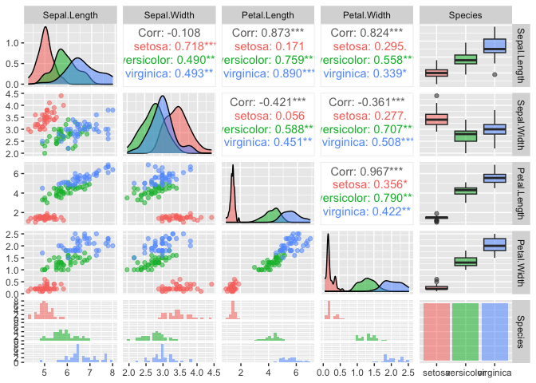

Load the `iris` data and divide the dataset into a training and a test
set (ratio 80/20).

``` r
library(caTools) # needed for sample.split
library(ggplot2) # needed for nicer graphics
library(GGally)  # needed for ggpairs
```

    ## Registered S3 method overwritten by 'GGally':
    ##   method from   
    ##   +.gg   ggplot2

``` r
library(e1071)   # needed for the SVM itself

set.seed(41)        # to make it reproducible

dataset <- iris
str(dataset)
```

    ## 'data.frame':    150 obs. of  5 variables:
    ##  $ Sepal.Length: num  5.1 4.9 4.7 4.6 5 5.4 4.6 5 4.4 4.9 ...
    ##  $ Sepal.Width : num  3.5 3 3.2 3.1 3.6 3.9 3.4 3.4 2.9 3.1 ...
    ##  $ Petal.Length: num  1.4 1.4 1.3 1.5 1.4 1.7 1.4 1.5 1.4 1.5 ...
    ##  $ Petal.Width : num  0.2 0.2 0.2 0.2 0.2 0.4 0.3 0.2 0.2 0.1 ...
    ##  $ Species     : Factor w/ 3 levels "setosa","versicolor",..: 1 1 1 1 1 1 1 1 1 1 ...

``` r
summary(dataset)
```

    ##   Sepal.Length    Sepal.Width     Petal.Length    Petal.Width   
    ##  Min.   :4.300   Min.   :2.000   Min.   :1.000   Min.   :0.100  
    ##  1st Qu.:5.100   1st Qu.:2.800   1st Qu.:1.600   1st Qu.:0.300  
    ##  Median :5.800   Median :3.000   Median :4.350   Median :1.300  
    ##  Mean   :5.843   Mean   :3.057   Mean   :3.758   Mean   :1.199  
    ##  3rd Qu.:6.400   3rd Qu.:3.300   3rd Qu.:5.100   3rd Qu.:1.800  
    ##  Max.   :7.900   Max.   :4.400   Max.   :6.900   Max.   :2.500  
    ##        Species  
    ##  setosa    :50  
    ##  versicolor:50  
    ##  virginica :50  
    ##                 
    ##                 
    ## 

``` r
split        = sample.split(dataset$Species, SplitRatio = .8)
training_set = subset(dataset, split == TRUE)
test_set     = subset(dataset, split == FALSE)

nrow(training_set)
```

    ## [1] 120

``` r
nrow(test_set)
```

    ## [1] 30

We have 120 data rows on which to train the model, and 30 rows on which
to subsequently test it.

Look at the training set more closely, using the plot command `ggpairs`.

``` r
ggpairs(training_set, ggplot2::aes(colour = Species, alpha = 0.4))
```

    ## `stat_bin()` using `bins = 30`. Pick better value with `binwidth`.
    ## `stat_bin()` using `bins = 30`. Pick better value with `binwidth`.
    ## `stat_bin()` using `bins = 30`. Pick better value with `binwidth`.
    ## `stat_bin()` using `bins = 30`. Pick better value with `binwidth`.



This improved pairs-plot contains a large amount of very useful
information.

-   From the histograms in the bottom 3 rows of the chart of
    `Petal.length` (3rd column) and `Petal.width` (4th column) we
    observe a clear separation of the Setosa species.
-   However, there is an overlap of the Versicolor and Virginica
    species.
-   If we look at the scatterplots of `Sepal.Length` vs `Petal.Length`
    (row 3, column 2) and `Petal.Width` vs `Petal.Length` (row 4, column
    3), we can distinctly see a seperator that can be drawn between the
    groups of species.

Conclusion from the exploratory data analysis: we can use only
`Petal.Width` and `Petal.Length` as parameters for a good model.

We will create two models:

1.  containing all 4 parameters,
2.  containing only the 2 parameters `Petal.Width` and `Petal.Length`,

and then compare their performances.

## Scale the features and fit the models

``` r
training_set[,1:4] = scale(training_set[,1:4])
test_set[,1:4]     = scale(test_set[,1:4])
# model with ALL parameters:
classifier1 = svm(formula = Species~., data = training_set, 
                  type = 'C-classification', kernel = 'radial')
# 2-parameter model:
classifier2 = svm(formula = Species~ Petal.Width + Petal.Length, data = training_set, 
                  type = 'C-classification', kernel = 'radial')
```

## Prediction and accuracy evaluation

We compute the prdiction accuracy directly on the test set.

``` r
test_pred1 = predict(classifier1, type = 'response', newdata = test_set[-5])
test_pred2 = predict(classifier2, type = 'response', newdata = test_set[-5])

# Compute the confusion matrices
cm1 = table(test_set[,5], test_pred1)
cm2 = table(test_set[,5], test_pred2)
cm1 # Confusion Matrix for all parameters
```

    ##             test_pred1
    ##              setosa versicolor virginica
    ##   setosa         10          0         0
    ##   versicolor      0         10         0
    ##   virginica       0          1         9

``` r
cm2 # Confusion Matrix for 2-parameter model (Petal Length and Petal Width)
```

    ##             test_pred2
    ##              setosa versicolor virginica
    ##   setosa         10          0         0
    ##   versicolor      0         10         0
    ##   virginica       0          2         8

## Conclusion

The accuracy of both models is excellent. We conclude that the
2-parameter model suffices.
