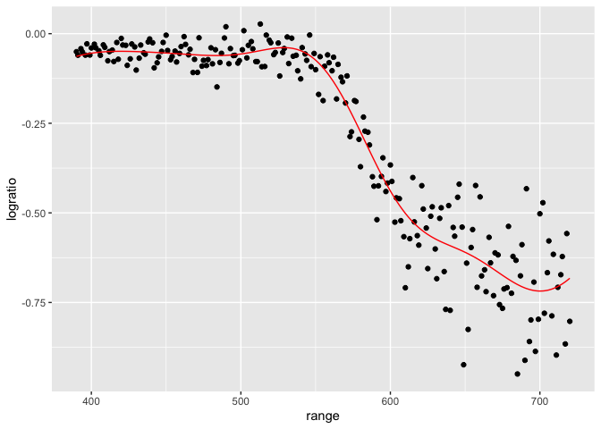

Load the libraries required for plotting and SVM.

``` r
library(tidyverse)    # for ggplot2, dplyr
library(e1071)        # for svm() function
```

## Regression using SVMs

Load the lidar data frame that has 221 observations from a light
detection and ranging (LIDAR) experiment. In practice, the R code is
unchanged from the classification context. We use a radial kernel and
standard cross-validation, then extract the best model.

``` r
data('lidar', package='SemiPar')

ctrl <- tune.control(
  sampling='cross',    # Cross-validation (the default)
  cross=10,            # Number of folds (default = 10)
  nrepeat=5)           # Number of repeats (default is 1) 
train.grid <- list(cost=2^(-2:5), gamma=2^seq(-1, 1, by=.5))

tuned <- tune(svm, logratio ~ range, data=lidar, kernel='radial',
              ranges = train.grid, tunecontrol = ctrl)
# summary(tuned)
best.svm <- tuned$best.model
summary(best.svm)
```

    ## 
    ## Call:
    ## best.tune(METHOD = svm, train.x = logratio ~ range, data = lidar, 
    ##     ranges = train.grid, tunecontrol = ctrl, kernel = "radial")
    ## 
    ## 
    ## Parameters:
    ##    SVM-Type:  eps-regression 
    ##  SVM-Kernel:  radial 
    ##        cost:  2 
    ##       gamma:  2 
    ##     epsilon:  0.1 
    ## 
    ## 
    ## Number of Support Vectors:  130

``` r
lidar$yhat <- predict(best.svm)

ggplot(lidar, aes(x=range)) +
  geom_point(aes(y=logratio)) +
  geom_line(aes(y=yhat), color='red')
```


