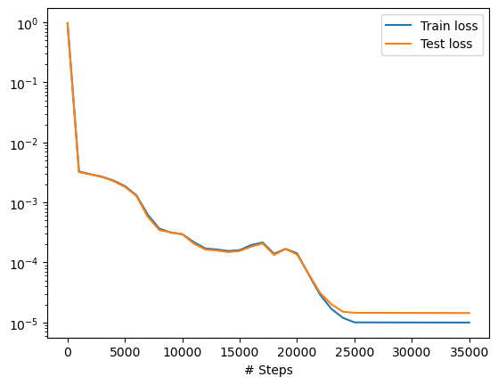
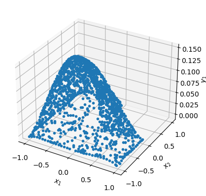

# Poisson equation over an L-shaped domain

We solve
$$
- u_{xx}-u_{yy} = 1, \qquad  \Omega = [-1,1]^2 \backslash [0,1]^2
$$
with Dirichlet boundary conditions everywhere,
$$
u(x,y)=0, \qquad (x,y)\in \partial \Omega.
$$

Please see DeepXDE [doc](https://deepxde.readthedocs.io/en/latest/demos/pinn_forward/poisson.Lshape.html) for fuller details.


```python
import deepxde as dde


def pde(x, y):
    dy_xx = dde.grad.hessian(y, x, i=0, j=0)
    dy_yy = dde.grad.hessian(y, x, i=1, j=1)
    return -dy_xx - dy_yy - 1


def boundary(_, on_boundary):
    return on_boundary


geom = dde.geometry.Polygon([[0, 0], [1, 0], [1, -1], [-1, -1], [-1, 1], [0, 1]])
bc = dde.icbc.DirichletBC(geom, lambda x: 0, boundary)

data = dde.data.PDE(geom, pde, bc, num_domain=1200, num_boundary=120, num_test=1500)
net = dde.nn.FNN([2] + [50] * 4 + [1], "tanh", "Glorot uniform")
model = dde.Model(data, net)

model.compile("adam", lr=0.001)
model.train(iterations=20000)
model.compile("L-BFGS")
losshistory, train_state = model.train()
dde.saveplot(losshistory, train_state, issave=True, isplot=True)
```

    Using backend: pytorch
    Other supported backends: tensorflow.compat.v1, tensorflow, jax, paddle.
    paddle supports more examples now and is recommended.


    Warning: Polygon.uniform_points not implemented. Use random_points instead.
    Compiling model...
    'compile' took 0.000060 s
    
    Training model...
    
    Step      Train loss              Test loss               Test metric
    0         [9.15e-01, 5.93e-02]    [9.13e-01, 5.93e-02]    []  
    1000      [2.79e-04, 3.00e-03]    [2.11e-04, 3.00e-03]    []  
    2000      [1.14e-04, 2.84e-03]    [8.72e-05, 2.84e-03]    []  
    3000      [1.09e-04, 2.58e-03]    [7.95e-05, 2.58e-03]    []  
    4000      [1.94e-04, 2.13e-03]    [1.46e-04, 2.13e-03]    []  
    5000      [2.70e-04, 1.60e-03]    [2.16e-04, 1.60e-03]    []  
    6000      [2.73e-04, 1.05e-03]    [2.37e-04, 1.05e-03]    []  
    7000      [1.82e-04, 4.42e-04]    [1.31e-04, 4.42e-04]    []  
    8000      [1.12e-04, 2.55e-04]    [9.07e-05, 2.55e-04]    []  
    9000      [1.19e-04, 1.95e-04]    [1.23e-04, 1.95e-04]    []  
    10000     [1.28e-04, 1.67e-04]    [1.29e-04, 1.67e-04]    []  
    11000     [7.40e-05, 1.44e-04]    [6.20e-05, 1.44e-04]    []  
    12000     [3.42e-05, 1.37e-04]    [2.75e-05, 1.37e-04]    []  
    13000     [2.77e-05, 1.37e-04]    [2.16e-05, 1.37e-04]    []  
    14000     [2.55e-05, 1.30e-04]    [1.92e-05, 1.30e-04]    []  
    15000     [2.98e-05, 1.31e-04]    [2.41e-05, 1.31e-04]    []  
    16000     [6.45e-05, 1.31e-04]    [5.24e-05, 1.31e-04]    []  
    17000     [8.38e-05, 1.31e-04]    [7.53e-05, 1.31e-04]    []  
    18000     [2.01e-05, 1.19e-04]    [1.42e-05, 1.19e-04]    []  
    19000     [4.77e-05, 1.21e-04]    [4.66e-05, 1.21e-04]    []  
    20000     [2.42e-05, 1.17e-04]    [1.82e-05, 1.17e-04]    []  
    
    Best model at step 18000:
      train loss: 1.40e-04
      test loss: 1.34e-04
      test metric: []
    
    'train' took 141.981709 s
    
    Compiling model...
    'compile' took 0.000178 s
    
    Training model...
    
    Step      Train loss              Test loss               Test metric
    20000     [2.42e-05, 1.17e-04]    [1.82e-05, 1.17e-04]    []  
    21000     [1.35e-05, 5.03e-05]    [1.50e-05, 5.03e-05]    []  
    22000     [9.47e-06, 1.97e-05]    [1.14e-05, 1.97e-05]    []  
    23000     [6.20e-06, 1.06e-05]    [9.44e-06, 1.06e-05]    []  
    24000     [4.46e-06, 7.46e-06]    [7.63e-06, 7.46e-06]    []  
    25000     [3.46e-06, 6.58e-06]    [7.91e-06, 6.58e-06]    []  
    26000     [3.45e-06, 6.58e-06]    [7.90e-06, 6.58e-06]    []  
    27000     [3.44e-06, 6.58e-06]    [7.89e-06, 6.58e-06]    []  
    28000     [3.44e-06, 6.57e-06]    [7.88e-06, 6.57e-06]    []  
    29000     [3.43e-06, 6.57e-06]    [7.87e-06, 6.57e-06]    []  
    30000     [3.43e-06, 6.56e-06]    [7.86e-06, 6.56e-06]    []  
    31000     [3.43e-06, 6.56e-06]    [7.85e-06, 6.56e-06]    []  
    32000     [3.43e-06, 6.56e-06]    [7.85e-06, 6.56e-06]    []  
    33000     [3.42e-06, 6.55e-06]    [7.84e-06, 6.55e-06]    []  
    34000     [3.42e-06, 6.55e-06]    [7.83e-06, 6.55e-06]    []  
    35000     [3.42e-06, 6.55e-06]    [7.82e-06, 6.55e-06]    []  
    
    Best model at step 35000:
      train loss: 9.97e-06
      test loss: 1.44e-05
      test metric: []
    
    'train' took 133.421110 s
    
    Saving loss history to /Users/markasch/Dropbox/3Teaching/Assim/Assim_ML_2023_Caraga/02course-advanced/02Examples/01_SciML/DDE/loss.dat ...
    Saving training data to /Users/markasch/Dropbox/3Teaching/Assim/Assim_ML_2023_Caraga/02course-advanced/02Examples/01_SciML/DDE/train.dat ...
    Saving test data to /Users/markasch/Dropbox/3Teaching/Assim/Assim_ML_2023_Caraga/02course-advanced/02Examples/01_SciML/DDE/test.dat ...


    

    


    

    


```python

```
