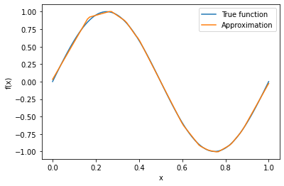
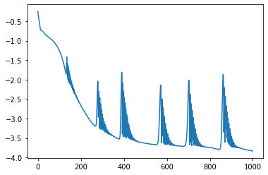
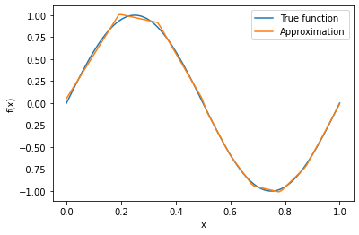
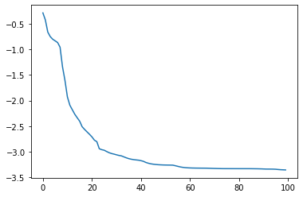

# Function approximation by an NN

A neural network is used here to find an unknown function from noisy measurements. Please note that, as opposed to what has been previously done with regression-type models, here we have no information (nor hypotheses) about the function's structure or form. This is therefore a true inverse problem: from noisy measurements,  find the unknown function that generated them.


In this example, the function $f(x)$ is defined as the sine function. 

- We approximate it using a fully connected neural network with three hidden layers of size 32. 
- The model is trained using the mean squared error loss function (`nn.MSELoss`).
- The Adam and LBGFGS optimizers are used (`optim.Adam`, `optim.LBFGS`). 

The training loop runs for 1000 epochs, and the loss is printed every 100 epochs. After training, the evolution of the function approximation is plotted, and the final loss is displayed.

You can modify the code according to your specific function f(x) and adjust the neural network architecture, loss function, optimizer, and training parameters as needed.


```python
import torch
import torch.nn as nn
import torch.optim as optim
import numpy as np
import matplotlib.pyplot as plt

# Define the function f(x)
def f(x):
    return np.sin(2 * np.pi * x)

# Generate some discrete points in the interval [0, 1]
x = np.linspace(0, 1, 100)
y_true = f(x)

# Convert the data to PyTorch tensors
x_tensor = torch.tensor(x, dtype=torch.float32).view(-1, 1)
y_true_tensor = torch.tensor(y_true, dtype=torch.float32).view(-1, 1)

# Define the fully connected neural network model
class NeuralNetwork(nn.Module):
    def __init__(self):
        super(NeuralNetwork, self).__init__()
        self.fc1 = nn.Linear(1, 32)
        self.fc2 = nn.Linear(32, 32)
        self.fc3 = nn.Linear(32, 1)

    def forward(self, x):
        x = torch.relu(self.fc1(x))
        x = torch.relu(self.fc2(x))
        x = self.fc3(x)
        return x

# Create an instance of the neural network model
model = NeuralNetwork()

# Define the loss function
criterion = nn.MSELoss()

# Define the optimizer
optimizer = optim.Adam(model.parameters(), lr=0.01)

# Training loop
num_epochs = 1000
losses = []

for epoch in range(num_epochs):
    # Forward pass
    outputs = model(x_tensor)
    loss = criterion(outputs, y_true_tensor)

    # Backward and optimize
    optimizer.zero_grad()
    loss.backward()
    optimizer.step()

    # Track the loss
    losses.append(loss.item())

    # Print the progress every 100 epochs
    if (epoch + 1) % 100 == 0:
        print(f"Epoch [{epoch+1}/{num_epochs}], Loss: {loss.item():.4f}")

# Plot the evolution of the function approximation
plt.plot(x, y_true, label='True function')
plt.plot(x, model(x_tensor).detach().numpy(), label='Approximation')
plt.xlabel('x')
plt.ylabel('f(x)')
plt.legend()
plt.show()

# Display the final loss
print(f"Final Loss: {losses[-1]:.4g}")

```

    Epoch [100/1000], Loss: 0.0565
    Epoch [200/1000], Loss: 0.0022
    Epoch [300/1000], Loss: 0.0012
    Epoch [400/1000], Loss: 0.0050
    Epoch [500/1000], Loss: 0.0002
    Epoch [600/1000], Loss: 0.0005
    Epoch [700/1000], Loss: 0.0037
    Epoch [800/1000], Loss: 0.0002
    Epoch [900/1000], Loss: 0.0002
    Epoch [1000/1000], Loss: 0.0001


    

    


    Final Loss: 0.0001474


```python
plt.plot(np.log10(losses))
```


    [<matplotlib.lines.Line2D at 0x16bdb2d70>]


    

    


## Refactor using LBFGS

In this modified version, we replaced the Adam optimizer with the LBFGS optimizer (`optim.LBFGS`). 

The LBFGS optimizer in PyTorch requires a `closure` function that computes both the forward and backward passes. The closure function is passed to the optimizer's `step()` method, which performs a single optimization step. The loss is computed and backpropagation is performed inside the closure function.

The rest of the code remains the same as before, including the definition of the neural network, the loss function, and the training loop. The evolution of the function approximation is plotted, and the final loss is displayed at the end.


```python
import torch
import torch.nn as nn
import torch.optim as optim
import numpy as np
import matplotlib.pyplot as plt

# Define the function f(x)
def f(x):
    return np.sin(2 * np.pi * x)

# Generate some discrete points in the interval [0, 1]
x = np.linspace(0, 1, 100)
y_true = f(x)

# Convert the data to PyTorch tensors
x_tensor = torch.tensor(x, dtype=torch.float32).view(-1, 1)
y_true_tensor = torch.tensor(y_true, dtype=torch.float32).view(-1, 1)

# Define the fully connected neural network model
class NeuralNetwork(nn.Module):
    def __init__(self):
        super(NeuralNetwork, self).__init__()
        self.fc1 = nn.Linear(1, 32)
        self.fc2 = nn.Linear(32, 32)
        self.fc3 = nn.Linear(32, 1)

    def forward(self, x):
        x = torch.relu(self.fc1(x)) # or torch.tanh()
        x = torch.relu(self.fc2(x)) # or torch.tanh()
        x = self.fc3(x)
        return x

# Create an instance of the neural network model
model = NeuralNetwork()

# Define the loss function
criterion = nn.MSELoss()

# Define the optimizer
optimizer = optim.LBFGS(model.parameters(), lr=0.01)

# Training loop
num_epochs = 100

def closure():
    optimizer.zero_grad()
    outputs = model(x_tensor)
    loss = criterion(outputs, y_true_tensor)
    loss.backward()
    return loss

losses = []
for epoch in range(num_epochs):
    loss = optimizer.step(closure)
    losses.append(loss.item())
    print(f"Epoch [{epoch+1}/{num_epochs}], Loss: {loss.item():.4f}")

# Plot the evolution of the function approximation
plt.plot(x, y_true, label='True function')
plt.plot(x, model(x_tensor).detach().numpy(), label='Approximation')
plt.xlabel('x')
plt.ylabel('f(x)')
plt.legend()
plt.show()

# Display the final loss
print(f"Final Loss: {losses[-1]:.4f}")

```

    Epoch [1/100], Loss: 0.5195
    Epoch [2/100], Loss: 0.3793
    Epoch [3/100], Loss: 0.2186
    Epoch [4/100], Loss: 0.1786
    Epoch [5/100], Loss: 0.1586
    Epoch [6/100], Loss: 0.1475
    Epoch [7/100], Loss: 0.1368
    Epoch [8/100], Loss: 0.1109
    Epoch [9/100], Loss: 0.0458
    Epoch [10/100], Loss: 0.0248
    Epoch [11/100], Loss: 0.0118
    Epoch [12/100], Loss: 0.0081
    Epoch [13/100], Loss: 0.0066
    Epoch [14/100], Loss: 0.0054
    Epoch [15/100], Loss: 0.0046
    Epoch [16/100], Loss: 0.0039
    Epoch [17/100], Loss: 0.0031
    Epoch [18/100], Loss: 0.0027
    Epoch [19/100], Loss: 0.0024
    Epoch [20/100], Loss: 0.0022
    Epoch [21/100], Loss: 0.0019
    Epoch [22/100], Loss: 0.0017
    Epoch [23/100], Loss: 0.0016
    Epoch [24/100], Loss: 0.0011
    Epoch [25/100], Loss: 0.0011
    Epoch [26/100], Loss: 0.0011
    Epoch [27/100], Loss: 0.0010
    Epoch [28/100], Loss: 0.0010
    Epoch [29/100], Loss: 0.0009
    Epoch [30/100], Loss: 0.0009
    Epoch [31/100], Loss: 0.0009
    Epoch [32/100], Loss: 0.0008
    Epoch [33/100], Loss: 0.0008
    Epoch [34/100], Loss: 0.0008
    Epoch [35/100], Loss: 0.0008
    Epoch [36/100], Loss: 0.0007
    Epoch [37/100], Loss: 0.0007
    Epoch [38/100], Loss: 0.0007
    Epoch [39/100], Loss: 0.0007
    Epoch [40/100], Loss: 0.0007
    Epoch [41/100], Loss: 0.0007
    Epoch [42/100], Loss: 0.0006
    Epoch [43/100], Loss: 0.0006
    Epoch [44/100], Loss: 0.0006
    Epoch [45/100], Loss: 0.0006
    Epoch [46/100], Loss: 0.0006
    Epoch [47/100], Loss: 0.0006
    Epoch [48/100], Loss: 0.0006
    Epoch [49/100], Loss: 0.0006
    Epoch [50/100], Loss: 0.0005
    Epoch [51/100], Loss: 0.0005
    Epoch [52/100], Loss: 0.0005
    Epoch [53/100], Loss: 0.0005
    Epoch [54/100], Loss: 0.0005
    Epoch [55/100], Loss: 0.0005
    Epoch [56/100], Loss: 0.0005
    Epoch [57/100], Loss: 0.0005
    Epoch [58/100], Loss: 0.0005
    Epoch [59/100], Loss: 0.0005
    Epoch [60/100], Loss: 0.0005
    Epoch [61/100], Loss: 0.0005
    Epoch [62/100], Loss: 0.0005
    Epoch [63/100], Loss: 0.0005
    Epoch [64/100], Loss: 0.0005
    Epoch [65/100], Loss: 0.0005
    Epoch [66/100], Loss: 0.0005
    Epoch [67/100], Loss: 0.0005
    Epoch [68/100], Loss: 0.0005
    Epoch [69/100], Loss: 0.0005
    Epoch [70/100], Loss: 0.0005
    Epoch [71/100], Loss: 0.0005
    Epoch [72/100], Loss: 0.0005
    Epoch [73/100], Loss: 0.0005
    Epoch [74/100], Loss: 0.0005
    Epoch [75/100], Loss: 0.0005
    Epoch [76/100], Loss: 0.0005
    Epoch [77/100], Loss: 0.0005
    Epoch [78/100], Loss: 0.0005
    Epoch [79/100], Loss: 0.0005
    Epoch [80/100], Loss: 0.0005
    Epoch [81/100], Loss: 0.0005
    Epoch [82/100], Loss: 0.0005
    Epoch [83/100], Loss: 0.0005
    Epoch [84/100], Loss: 0.0005
    Epoch [85/100], Loss: 0.0005
    Epoch [86/100], Loss: 0.0005
    Epoch [87/100], Loss: 0.0005
    Epoch [88/100], Loss: 0.0005
    Epoch [89/100], Loss: 0.0005
    Epoch [90/100], Loss: 0.0005
    Epoch [91/100], Loss: 0.0005
    Epoch [92/100], Loss: 0.0005
    Epoch [93/100], Loss: 0.0005
    Epoch [94/100], Loss: 0.0005
    Epoch [95/100], Loss: 0.0005
    Epoch [96/100], Loss: 0.0005
    Epoch [97/100], Loss: 0.0004
    Epoch [98/100], Loss: 0.0004
    Epoch [99/100], Loss: 0.0004
    Epoch [100/100], Loss: 0.0004


    

    


    Final Loss: 0.0004


```python
plt.plot(np.log10(losses))
```


    [<matplotlib.lines.Line2D at 0x16bce6620>]


    

    


```python
model
```


    NeuralNetwork(
      (fc1): Linear(in_features=1, out_features=32, bias=True)
      (fc2): Linear(in_features=32, out_features=32, bias=True)
      (fc3): Linear(in_features=32, out_features=1, bias=True)
    )


## Conclusions

1. A simple fully-connected, feedforward neural network is able to find a completely unknown function, based exclusively on noisy measurements.
2. The LBFGS optimizer, when suitably tuned and adapted to the problem, can provide smoother and much faster convergence of the NN model.


```python

```
