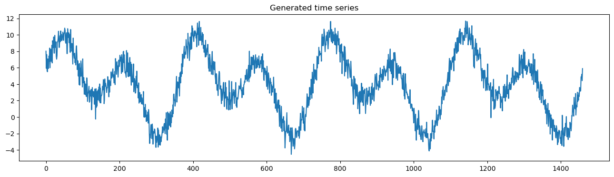
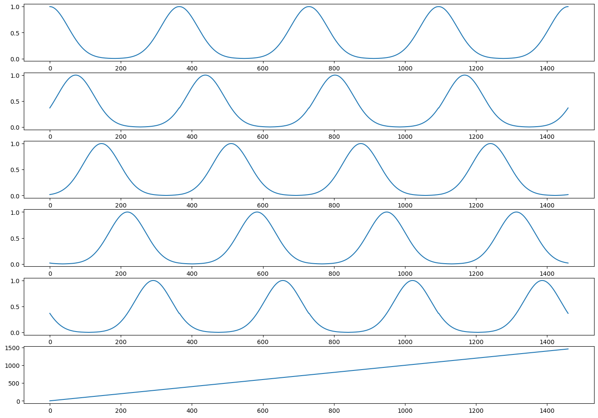
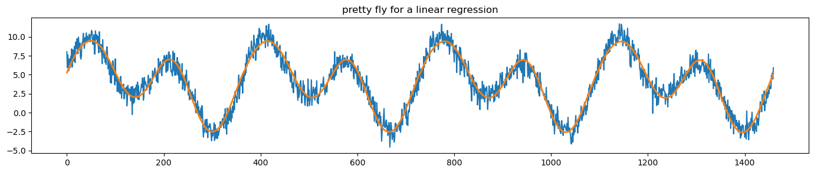
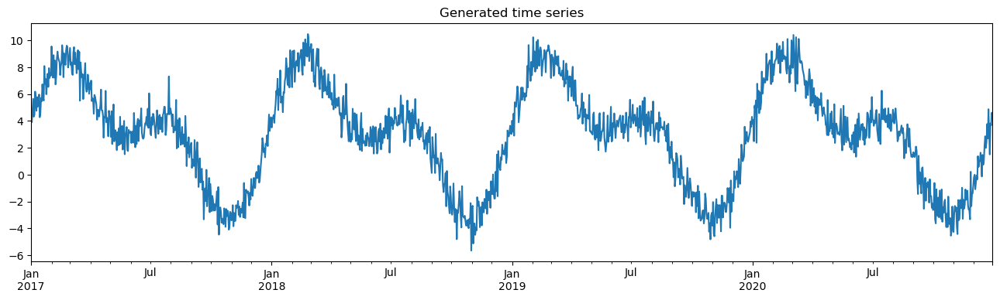
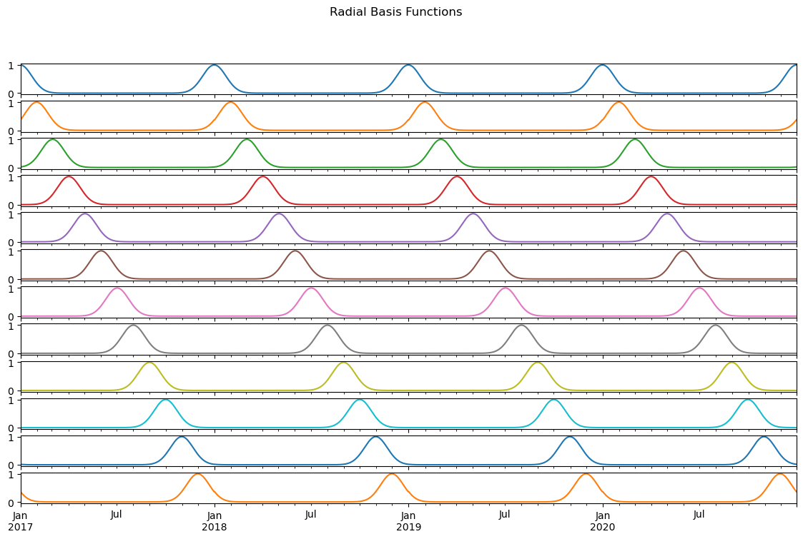
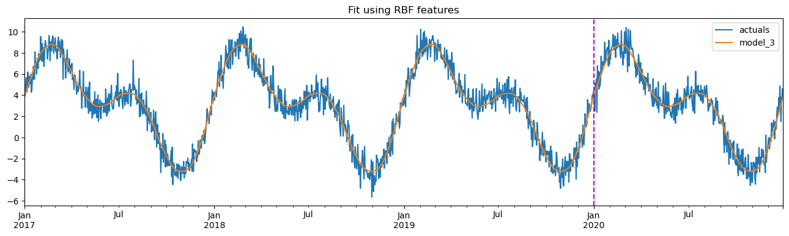
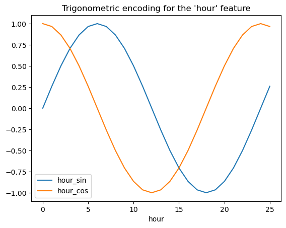
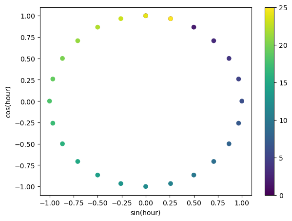

# Cyclical Data

Often,  data is inherently cyclical. 

> Time is a rich example of this: minutes, hours, seconds, day of week, week of month, month, season, and so on, all follow cycles. 

Ecological features like tide, Astrological features like position in orbit, spatial features like rotation or longitude, visual features like color wheels are all naturally cyclical.

> Our problem is: how can we inform the machine learning model that a feature is cyclical?

There are several approaches, of which we present two:

- sine-cosine transformations
- radial basis functions

This  is an excellent example of how **feature engineering** can simplify the subsequent machine learning modeling. In this case, we will see that simple linear regression can be used to model a complex, cyclical time series, once a good transformation has been applied to the input data. We thus avoid the use of complex ML models and as a result improve the bias-variance tradeoff and reduce risks of overfitting. Of course, we gain in interpretability and transparency too. 

> We shift the complexity from the model to the features.

## Simplest version

Follow the `scikit-lego` doc...

As noted above, for the days of the year, 1-Jan-2019 (day 1) is just as close to 2-Jan-2019 (day 2) as it is to 31-Dec-2018 (day 365). If you simply encode day of year numerically you lose this information, i.e. 1 is close 2 to but far from 365. The repeating radial basis function transformer can remedy this problem.

The transformer selects a column and transforms it with a given number of repeating (radial) basis functions, which have a Gaussian/bell curve shape. The basis functions are equally spaced over the input range. The key feature of repeating basis functions is that they are continuous when moving from the max to the min of the input range. As a result these repeating basis functions can capture how close each datapoint is to the center of each repeating basis function, even when the input data has a circular nature.


```python
import numpy as np
import pandas as pd
import matplotlib.pyplot as plt
from sklearn.linear_model import LinearRegression
from repeatingbasis import RepeatingBasisFunction
```

### Generate synthetic data

We generate a synthetic data set as a superposition of two sine curves plus addtivie random noise. The data is assumed to be

- daily
- over 4 years


```python
# generate features
X = pd.DataFrame()
X['day'] = np.arange(4*365)
X['day_of_year'] = 1 + X['day'] % 365

# generate target
signal1 = 4 + 3*np.sin(X['day']/365*2*np.pi)
signal2 = 4 * np.sin(X['day']/365*4*np.pi+365/2)
noise = np.random.normal(0, 0.9, len(X['day']))
y = signal1 + signal2 + noise

# plot
y.plot(figsize=(16,4), title="Generated time series");
```


    

    


We now generate repeating basis functions based on the variable `day_of_year`.


```python
N_PERIODS = 5
rbf = RepeatingBasisFunction(n_periods=N_PERIODS,
                             remainder='passthrough',
                             column='day_of_year',
                             input_range=(1,365))
rbf.fit(X)
Xt = rbf.transform(X)
```

Plot the transformed features.


```python
fig, axes = plt.subplots(nrows=Xt.shape[1], figsize=(17,12))
for i in range(Xt.shape[1]):
    axes[i].plot(X['day'], Xt[:,i])
plt.show()
```


    

    


The `day_of_year` feature has been replaced with `N_PERIODS` repeating basis functions. These are bell curves that are equidistant over the 1-365 range. Each curve captures the information of “being close to” a particular `day_of_year`. For example, the curve in the top row captures how close a day is to New Year’s day. It peaks on day 1 with a value of 1 and smoothly drops at an equal rate in December and in the rest of January.

Note, how the `day` feature still exists, in the transformed feature set as a result of the `remainder='passthrough'` setting. The default setting `remainder='drop'` will only keep the repeating basis functions and drop all columns of the original dataset.

### LINEAR REGRESSION

We now use these transformed features as a basis for a linear regression on the target, `y`. 


```python
plt.figure(figsize=(17,3))
plt.plot(X['day'], y)
plt.plot(X['day'], LinearRegression().fit(Xt, y).predict(Xt), linewidth=2.0)
plt.title("pretty fly for a linear regression");
```


    

    


### Conclusion

We have obtaied a remarkably good fit to the nonlinear target, `y`, using a linear regression on the suitably transformed, cyclical features. This regression can thus be used as a surrogate model for performing analysis and forecasting. 

## Date and time version

Follow this [blog](https://developer.nvidia.com/blog/three-approaches-to-encoding-time-information-as-features-for-ml-models/).

Here we will use the pervious approach of radial transformers, to fit a linear regression to an initial portion of the data and then perform forecasting on the remaining values.


```python
from datetime import date
from sklearn.linear_model import LinearRegression
from sklearn.preprocessing import FunctionTransformer
from sklearn.metrics import mean_absolute_error
```

### Data generation

We start by creating an empty DataFrame with an index spanning four calendar years, using Panda's  `pd.date_range`. Then, we create two columns:

- `day_nr` – a numeric index representing the passage of time
- `day_of_year` – the ordinal day of the year

Then, we generate the time series itself as a combination of two transformed sine curves plus random noise. 


```python
# for reproducibility
np.random.seed(42)

# generate the DataFrame with dates
range_of_dates = pd.date_range(start="2017-01-01", end="2020-12-30")
X = pd.DataFrame(index=range_of_dates)

# create a sequence of day numbers
X["day_nr"] = range(len(X))
X["day_of_year"] = X.index.day_of_year

# generate the components of the target
signal_1 = 3 + 4 * np.sin(X["day_nr"] / 365 * 2 * np.pi)
signal_2 = 3 * np.sin(X["day_nr"] / 365 * 4 * np.pi + 365/2)
noise = np.random.normal(0, 0.85, len(X))

# combine them to get the target series
y = signal_1 + signal_2 + noise

# plot
y.plot(figsize=(16,4), title="Generated time series");
```


    

    


Insert all of this into a pandas DataFrame.


```python
results_df = y.to_frame()
results_df.columns = ["actuals"]
TRAIN_END = 3 * 365 # cut-off time for the training
```

There are several approaches for dealing with cyclical data:

- one-hot encoding
- cyclical encoding with sine/cosine transformations
- radial basis function transformers

Here we use, as above, the radial basis function approach with the following parameters

- The number of basis functions we want to create equal to 12, i.e. monthly
- Which column to use for indexing the RBFs. In our case, that is the column containing information on which day of the year the given observation comes from.
- The range of the input – in our case, the range is from 1 to 365. 
- What to do with the remaining columns of the DataFrame we will use for fitting the estimator. ”drop” will only keep the created RBF features, ”passthrough” will keep both the old and new features.


```python
rbf = RepeatingBasisFunction(n_periods=12,
                         	column="day_of_year",
                         	input_range=(1,365),
                         	remainder="drop")
rbf.fit(X)
X_3 = pd.DataFrame(index=X.index,
               	data=rbf.transform(X))

X_3.plot(subplots=True, figsize=(14, 8),
     	sharex=True, title="Radial Basis Functions",
     	legend=False);
```


    

    


The plot shows the 12 radial basis functions that we have created using the day number as input. Each curve contains information about how close we are to a certain day of the year (because we chose that column). For example, the first curve measures distance from January 1, so it peaks on the first day of every year and decreases symmetrically as we move away from that date.

By design, the basis functions are equally spaced over the input range. We chose 12 as we wanted the RBFs to resemble months. This way, each function shows approximately (because of the months’ unequal length) the distance to the first day of the month.

### Linear Regression

Now, we fit a linear regression model using the 12 RBF features.


```python
model_3 = LinearRegression().fit(X_3.iloc[:TRAIN_END],
                             	y.iloc[:TRAIN_END])

results_df["model_3"] = model_3.predict(X_3)
results_df[["actuals", "model_3"]].plot(figsize=(16,4),
                                    	title="Fit using RBF features")
plt.axvline(date(2020, 1, 1), c="m", linestyle="--");
```


    

    


The plot shows that the model is able to accurately capture, and predict the real data when using the RBF features. 

There are two key parameters that we can tune when using radial basis functions:

- the number of the radial basis functions,
- the shape of the bell curves – it can be modified with the width argument of RepeatingBasisFunction.

One method for tuning these parameter values would be to use grid search to identify the optimal values for a given data set.

To compare models, we can set up a dataframe and compute accuracy scores. Here we use MAE (mean absolute error).


```python
score_list = []
for fit_col in ["model_3"]:
	scores = {
    	"model": fit_col,
    	"train_score": mean_absolute_error(
        	results_df.iloc[:TRAIN_END]["actuals"],
        	results_df.iloc[:TRAIN_END][fit_col]
    	),
    	"test_score": mean_absolute_error(
        	results_df.iloc[TRAIN_END:]["actuals"],
        	results_df.iloc[TRAIN_END:][fit_col]
    	)
	}
	score_list.append(scores)

scores_df = pd.DataFrame(score_list)
scores_df
```


<div>
<style scoped>
    .dataframe tbody tr th:only-of-type {
        vertical-align: middle;
    }

    .dataframe tbody tr th {
        vertical-align: top;
    }

    .dataframe thead th {
        text-align: right;
    }
</style>
<table border="1" class="dataframe">
  <thead>
    <tr style="text-align: right;">
      <th></th>
      <th>model</th>
      <th>train_score</th>
      <th>test_score</th>
    </tr>
  </thead>
  <tbody>
    <tr>
      <th>0</th>
      <td>model_3</td>
      <td>0.657744</td>
      <td>0.692134</td>
    </tr>
  </tbody>
</table>
</div>


## Sine/Cosine transformers for cyclical data

See the [time-related feature engineering](https://scikit-learn.org/stable/auto_examples/applications/plot_cyclical_feature_engineering.html) doc of `scikit-learn`.

The idea is to encode each of the periodic features using a sine and cosine transformation with the matching period.

Each ordinal time feature is transformed into 2 features that together encode equivalent information in a non-monotonic way, and more importantly without any jump between the first and the last value of the periodic range.


```python
from sklearn.preprocessing import FunctionTransformer

def sin_transformer(period):
    return FunctionTransformer(lambda x: np.sin(x / period * 2 * np.pi))

def cos_transformer(period):
    return FunctionTransformer(lambda x: np.cos(x / period * 2 * np.pi))
```

To  visualize the effect of this feature expansion, we genrate synthetic hourly data with a bit of extrapolation beyond hour=23.


```python
import pandas as pd

hour_df = pd.DataFrame(
    np.arange(26).reshape(-1, 1),
    columns=["hour"],
)
hour_df["hour_sin"] = sin_transformer(24).fit_transform(hour_df)["hour"]
hour_df["hour_cos"] = cos_transformer(24).fit_transform(hour_df)["hour"]
hour_df.plot(x="hour")
_ = plt.title("Trigonometric encoding for the 'hour' feature")
```


    

    


Use a 2D scatter plot with the hours encoded as colors to better see how this representation maps the 24 hours of the day to a 2D space, similar to some sort of a 24 hour version of an analog clock. Note that the “25th” hour is mapped back to the 1st hour because of the periodic nature of the sine/cosine representation.


```python
fig, ax = plt.subplots(figsize=(7, 5))
sp = ax.scatter(hour_df["hour_sin"], hour_df["hour_cos"], c=hour_df["hour"])
ax.set(
    xlabel="sin(hour)",
    ylabel="cos(hour)",
)
_ = fig.colorbar(sp)
```


    

    


```python

```
