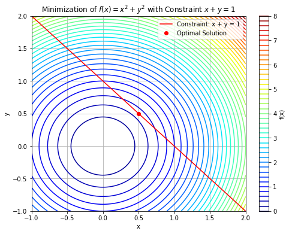

# Constrained Optimization - Lagrange Multipliers

## Optimization with Equality Constraint

In this example, we will minimize the quadratic function $$f(x) = x^2 + y^2 $$ subject to the equality constraint $$x + y = 1.$$ 
The `minimize` function from SciPy's optimization module automatically handles the KKT conditions, including the calculation of Lagrange multipliers.

When you run the code, you'll find the optimal solution, the associated Lagrange multiplier, and the optimal value of the objective function. The Lagrange multiplier indicates the sensitivity of the constraint to changes in the objective function.

You can use Python with libraries like NumPy, Matplotlib, and SciPy to minimize the function 
$$f(x) = x^2 + y^2$$
subject to the constraint 
$$x + y = 1.$$ 

This code defines the objective function, constraint function, and uses the SciPy library's `minimize` function to find the minimum of $f(x)$ subject to the constraint $x + y = 1.$ It also plots the contour plot of $f(x)$ and the constraint.

Here's the code to minimize the function, plot $f(x),$ its contours, and the constraint.


```python
import numpy as np
import matplotlib.pyplot as plt
from scipy.optimize import minimize

# Define the objective function f(x)
def objective(x):
    return x[0]**2 + x[1]**2

# Define the constraint function g(x)
def constraint(x):
    return x[0] + x[1] - 1

# Initial guess
x0 = [0, 0]

# Define the optimization problem
constraint_definition = {'type': 'eq', 'fun': constraint}
result = minimize(objective, x0, constraints=constraint_definition)

# Extract the optimal solution
x_optimal = result.x
f_min = result.fun

# Create a grid of points for plotting
x = np.linspace(-1, 2, 400)
y = np.linspace(-1, 2, 400)
X, Y = np.meshgrid(x, y)

# Calculate the objective function values at each point on the grid
Z = X**2 + Y**2

# Plot the contour plot of f(x)
plt.figure(figsize=(8, 6))
#plt.contour(X, Y, Z, levels=50, cmap='viridis')
plt.contour(X, Y, Z, levels=50, cmap='jet')
plt.colorbar(label='f(x)')

# Plot the constraint x + y = 1
plt.plot(x, 1 - x, 'r', label='Constraint: x + y = 1')

# Mark the optimal solution
plt.plot(x_optimal[0], x_optimal[1], 'ro', label='Optimal Solution')

# Set labels and legend
plt.xlabel('x')
plt.ylabel('y')
plt.legend()

# Show the plot
plt.title('Minimization of $f(x) = x^2 + y^2$ with Constraint $x + y = 1$')
plt.grid(True)
plt.show()

# Print the optimal solution and minimum value
# Extract optimal solution and Lagrange multiplier
optimal_x = result.x
print("Optimal solution:", optimal_x)
print("Optimal value:", objective(optimal_x))
```


    

    


    Optimal solution: [0.5 0.5]
    Optimal value: 0.5


### Other examples


```python
import numpy as np
from scipy.optimize import minimize

# Objective function to optimize
def objective(x):
    return +1 * (x[0]**2 + 2*x[1]**2)  # Negate for maximization

# Constraint function
def constraint(x):
    return x[0] + x[1] - 1

# Initial guess
x0 = np.array([0.0, 0.0])

# Define constraints
con = ({'type': 'eq', 'fun': constraint})

# Perform constrained optimization
result = minimize(objective, x0, constraints=con)

print("Optimal solution:", result.x)
```

    Optimal solution: [0.66687967 0.33312033]


```python
import scipy.optimize as opt

# Define the function to be minimized
def f(x):
   return (x[0] - 3)**2 + (x[1] + 2)**2

# Define the constraints
def g(x):
   return (x[0]**2 + x[1]**2 - 50)

# Define the constraints in the form required by the minimize function
cons = ({'type': 'eq', 'fun': g})

# Set the initial guess for the optimization
x0 = np.array([3, -5])

# Minimize the objective function subject to the constraints
result = opt.minimize(f, x0, constraints=cons)

# Print message indicating why the process terminated
print(result.message)

# Print the relevant x-value that results in constrained minimum
print(result.x)

# Use the result to validate the solution to the optimization problem (should be close to 0)
print(g(result.x))
```

    Optimization terminated successfully
    [ 5.88348399 -3.92232279]
    1.4921397450962104e-13


```python
import numpy as np
from scipy.optimize import fmin_bfgs

def f(X):
    x=X[0]
    y=X[1]
    return x**2+y**2

def g(X):
    x=X[0]
    y=X[1]
    return y-x-4.000

def L(X):
    return f(X)-4*g(X)

x0=np.array([0,0])
xopt=fmin_bfgs(L,x0,disp=True)
```

    Optimization terminated successfully.
             Current function value: 8.000000
             Iterations: 2
             Function evaluations: 9
             Gradient evaluations: 3


```python

```
